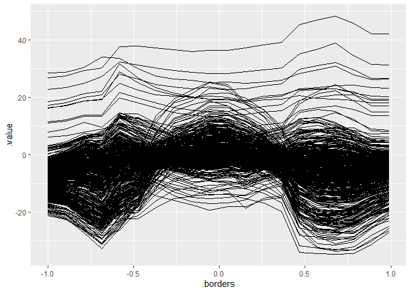
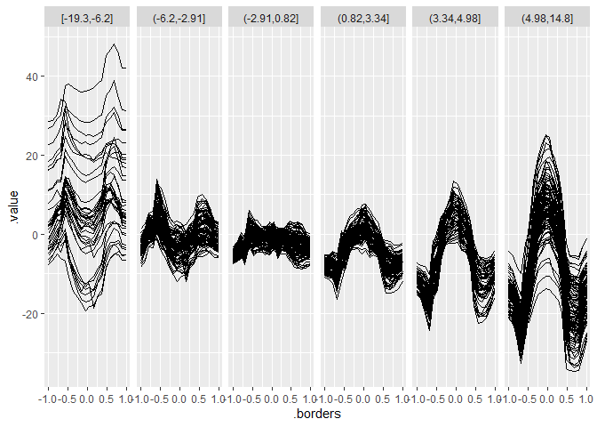

# Install

To make use of functions from this package, you need to clone this
repository, install the `devtools` R package, navigate to the directory
of this package and use the `load_all()` function.

``` r
# install.packages("devtools")
library(devtools)
load_all()
```

Install the development version from GitHub:

``` r
# Currently, documentation is missing. Hence, installation may fail
# remotes::install_github("giuseppec/customtrees")
```

# Notes

  - This package is not intended to be fast. It serves as a modular
    framework and playground to explore/study the splitting of features
    by custom objectives.
  - Currently only trees of depth 1 are fitted with `split_parent_node`.
    If you want a tree, you need to call this function recursively on
    the generated child nodes. You can use `generate_node_index` to get
    the split indices of the observations from the current node.
  - Splits for categorical variables currently not implemented and
    tested. Try to handle categoricals as numerics as workaround.
  - The `perform_split` function computes (and aggregates) the objective
    in the generated nodes after splitting w.r.t. specific split points.
  - Binary splits generate two nodes and are implemented in
    `find_best_binary_split`. The implementation does exhaustive search
    of split point candidates to find the best split point for a given
    feature.
  - Multiple splits generate multiple nodes and are implemented in
    `find_best_multiway_split`. The implementation currently uses a slow
    simulated annealing optimization to find the best split point for a
    given feature (might be improved and replaced with other, faster
    optimization procedures).

# Define Objectives used as Split Criteria

``` r
library(tidyverse)
library(Rmalschains)
library(dfoptim)
library(iml)
library(ranger)
library(kmlShape)
library(dtw)
```

``` r
# objective that fits a constant in the nodes (CART) 
SS = function(y, x, requires.x = FALSE) {
  ypred = mean(y)
  sum((y - ypred)^2)
}

# objective that fits a linear model in the nodes (mob)
SS_lm = function(y, x, requires.x = TRUE) {
  ypred = predict(lm(y ~ x))
  sum((y - ypred)^2)
}

# objective for multivariate targets (multivariate tree), see MultivariateRandomForest::Node_cost function
SS_mah = function(y, x, requires.x = FALSE, cov = NULL) {
  if (is.null(cov))
    cov = cov(y)
  center = colMeans(y)
  # cov = cov(y) we need to pass the cov of all data
  sum(mahalanobis(y, center = center, cov = cov, tol = 1e-30))
}

# Frechet distance FDA measure
SS_fre = function(y, x, requires.x = FALSE) { # slow
  # using only y-axis of curves is enough as x-axis is always the same for all curves
  require(kmlShape)
  center = colMeans(y)
  grid.x = as.numeric(names(center))
  pdp.y = unname(center)
  dist = apply(y, 1, function(ice) distFrechet(grid.x, pdp.y, grid.x, ice, FrechetSumOrMax = "sum"))
  sum(dist)
}

# Dynamic time warping FDA measure
SS_dtw = function(y, x, requires.x = FALSE) {
  require(dtw)
  pdp = colMeans(y) # this is the pdp
  dist = apply(y, 1, function(ice) dtw(ice, pdp, distance.only = TRUE)$normalizedDistance)
  sum(dist)
}
```

# CART with binary splits (constant model in node)

``` r
nsim = 1000L
x = x = sort(runif(n = nsim, min = 0, max = 2*pi))
q = quantile(x, seq(0, 1, length.out = 100), type = 1)
y = ifelse(x > pi/2, rnorm(nsim, mean = 0), rnorm(nsim, mean = 10, sd = 2))
X = data.frame(x = x)

split = split_parent_node(y, X, objective = SS, optimizer = find_best_binary_split)
split
```

    ##    feature objective.value runtime split.points best.split
    ## 1:       x        2113.473     0.2     1.605472       TRUE

``` r
# plot result
plot(x, y)
abline(v = unlist(split$split.points))
```

<!-- -->

# Extending CART to multiple splits (constant model in node)

``` r
y = ifelse(x < pi/2, rnorm(nsim, mean = 0), 
  ifelse(x < pi, rnorm(nsim, mean = 10, sd = 2), 
    rnorm(nsim, mean = -10, sd = 5)))

# MA-LS Chains
split = split_parent_node(y, X, objective = SS, optimizer = find_best_multiway_split_mals, 
  n.splits = 2)
# Hooke-Jeeves derivative-free
split2 = split_parent_node(y, X, objective = SS, optimizer = find_best_multiway_split_gensa, 
  n.splits = 2)

split
```

    ##    feature objective.value runtime      split.points best.split
    ## 1:       x        12695.16    0.88 1.572823,3.138709       TRUE

``` r
split2
```

    ##    feature objective.value runtime      split.points best.split
    ## 1:       x        12695.16    0.86 1.570827,3.142725       TRUE

``` r
plot(x, y)
abline(v = unlist(split2$split.points))
```

<!-- -->

# MOB with binary splits (linear model in node)

``` r
y = 4 + 2 * cos(x) + rnorm(nsim, mean = 0, sd = abs(cos(x)) / 2)

split = split_parent_node(y, X, objective = SS_lm, optimizer = find_best_binary_split, n.splits = 1)
split
```

    ##    feature objective.value runtime split.points best.split
    ## 1:       x        157.6209    0.42     3.167946       TRUE

``` r
plot(x, y)
abline(v = unlist(split$split.points))
```

<!-- -->

# MOB with multiple splits (linear model in node)

``` r
y = 4 + 2 * cos(x*2) + rnorm(nsim, mean = 0, sd = abs(cos(x)) / 2)

# MA-LS Chains
split = split_parent_node(y, X, objective = SS_lm, optimizer = find_best_multiway_split_mals, 
  n.splits = 3)
# Hooke-Jeeves derivative-free
split2 = split_parent_node(y, X, objective = SS_lm, optimizer = find_best_multiway_split_gensa, 
  n.splits = 3)

split
```

    ##    feature objective.value runtime               split.points best.split
    ## 1:       x        143.1463    6.47 1.580511,3.116469,4.713689       TRUE

``` r
split2
```

    ##    feature objective.value runtime               split.points best.split
    ## 1:       x        143.1315    3.95 1.575756,3.101333,4.716864       TRUE

``` r
plot(x, y)
abline(v = unlist(split$split.points))
```

<!-- -->

# Group ICE Curves with Multivariate Tree (binary splits, constant model in node)

We first generate some functional data:

``` r
# Simulate Data
n = 500
x1 = round(runif(n, -1, 1), 1)
x2 = round(runif(n, -1, 1), 3)
x3 = sample(c(0, 1), size = n, replace = TRUE, prob = c(0.5, 0.5))
x4 = sample(c(0, 1), size = n, replace = TRUE, prob = c(0.7, 0.3))
eps = rnorm(n, 0, 1)

# noisy vars
x5 = sample(c(0, 1), size = n, replace = TRUE, prob = c(0.5, 0.5))
x6 = rnorm(n, mean = 1, sd = 5)

y = 0.2*x1 - 8*x2 + ifelse(x3 == 0, I(16*x2),0) + ifelse(x1 > mean(x1), I(8*x2),0) + eps
# We also get interesting results using a 2-way interaction of numeric features
#y = 0.2*x1 - 8*x2 + 8*x6*x2 + eps
#y = 0.2*x1 - 8*x2^2 + 5*cos(x2*5)*x6 + ifelse(x3 == 0, I(8*x2),0) + eps

dat = data.frame(x1, x2, x3, x4, x5, x6, y)
X = dat[, setdiff(colnames(dat), "y")]

# Fit model and compute ICE for x2
mod = ranger(y ~ ., data = dat, num.trees = 500)
pred = predict.function = function(model, newdata) predict(model, newdata)$predictions
model = Predictor$new(mod, data = X, y = dat$y, predict.function = pred)
effect = FeatureEffects$new(model, method = "ice", grid.size = 20, features = "x2")

# Plot ICE curves: WE WANT TO FIND SUBGROUPS SUCH THAT ICE KURVES ARE HOMOGENOUS
ggplot(effect$results$x2, aes(x = .borders, y = .value)) + 
  geom_line(aes(group = .id))
```

<!-- -->

Formulate curves above by multivariate target and find feature that
splits the curves such that they are more homogenous in the nodes:

``` r
# Get ICE values and arrange them in a horizontal matrix
Y = spread(effect$results$x2, .borders, .value)
Y = Y[, setdiff(colnames(Y), c(".type", ".id", ".feature"))]
str(X) # contains our feature values
```

    ## 'data.frame':    500 obs. of  6 variables:
    ##  $ x1: num  -0.6 -0.2 -0.7 0.2 -0.7 -0.8 -0.3 1 0.1 -0.2 ...
    ##  $ x2: num  -0.846 0.09 0.102 0.844 0.957 0.503 -0.965 0.131 0.772 -0.688 ...
    ##  $ x3: num  0 0 0 0 1 1 0 0 0 0 ...
    ##  $ x4: num  0 1 1 0 1 0 0 0 0 1 ...
    ##  $ x5: num  0 1 0 1 0 1 1 0 1 1 ...
    ##  $ x6: num  2.838 0.656 1.965 1.386 12.49 ...

``` r
str(Y) # contains ICE values for each grid point
```

    ## 'data.frame':    500 obs. of  20 variables:
    ##  $ -1                : num  -6.99 -6.67 -6.92 -8.82 1.21 ...
    ##  $ -0.895157894736842: num  -6.33 -5.25 -6 -8.91 2.32 ...
    ##  $ -0.790315789473684: num  -5.44 -4.86 -5.19 -8.41 2.08 ...
    ##  $ -0.685473684210526: num  -5.27 -4.87 -4.97 -8.27 1.6 ...
    ##  $ -0.580631578947368: num  -4.89 -4.5 -4.65 -7.23 1.43 ...
    ##  $ -0.475789473684211: num  -3.99 -3.44 -3.72 -5.63 1.04 ...
    ##  $ -0.370947368421053: num  -3.237 -2.91 -2.943 -4.618 0.967 ...
    ##  $ -0.266105263157895: num  -2.378 -2.09 -2.029 -3.765 0.534 ...
    ##  $ -0.161263157894737: num  -1.331 -1.076 -0.824 -2.492 -0.171 ...
    ##  $ -0.056421052631579: num  -0.359 -0.159 0.246 -0.542 -0.763 ...
    ##  $ 0.0484210526315789: num  0.3551 0.0876 0.8169 0.4789 -1.1446 ...
    ##  $ 0.153263157894737 : num  1.473 0.612 1.635 2.763 -1.759 ...
    ##  $ 0.258105263157895 : num  1.87 1.3 1.96 3.77 -1.92 ...
    ##  $ 0.362947368421052 : num  2.41 2.02 2.36 4.22 -2.2 ...
    ##  $ 0.467789473684211 : num  3 2.88 2.57 5.6 -2.48 ...
    ##  $ 0.572631578947368 : num  4.58 3.89 3.85 7.83 -3.12 ...
    ##  $ 0.677473684210526 : num  5.78 4.44 4.87 9.62 -3.3 ...
    ##  $ 0.782315789473684 : num  5.9 5.17 5.26 10.18 -3.95 ...
    ##  $ 0.887157894736842 : num  6.44 5.69 5.5 11.68 -4 ...
    ##  $ 0.992             : num  5.49 3.94 4.17 10.06 -4.62 ...

``` r
# compute covariance for data and use this in for mahalanobis distance in the objective
COV = cov(Y)
SS_mah2 = function(y, x, requires.x = FALSE) 
  SS_mah(y = y, x = x, requires.x = requires.x, cov = COV)
sp = split_parent_node(Y = Y, X = X, objective = SS_mah2, 
  n.splits = 1, optimizer = find_best_binary_split)
sp
```

    ##    feature objective.value runtime split.points best.split
    ## 1:      x1        9608.916    0.11        -0.05      FALSE
    ## 2:      x2        9928.067    0.31       0.5735      FALSE
    ## 3:      x3        9504.177    0.02          0.5       TRUE
    ## 4:      x4        9578.423    0.01          0.5      FALSE
    ## 5:      x5        9544.095    0.00          0.5      FALSE
    ## 6:      x6        9658.817    0.27   -0.4345761      FALSE

``` r
node_index = generate_node_index(Y, X, result = sp)
str(node_index)
```

    ## List of 2
    ##  $ class: Factor w/ 2 levels "[0,0.5]","(0.5,1]": 1 1 1 1 2 2 1 1 1 1 ...
    ##  $ index:List of 2
    ##   ..$ [0,0.5]: int [1:261] 1 2 3 4 7 8 9 10 16 17 ...
    ##   ..$ (0.5,1]: int [1:239] 5 6 11 12 13 14 15 23 26 29 ...

``` r
Y = as.data.table(Y)
# frechet distance yields same splits but is a bit slower
sp_frechet = split_parent_node(Y = Y, X = X, objective = SS_fre,
  n.splits = 1, optimizer = find_best_binary_split)
sp_frechet
```

    ##    feature objective.value runtime split.points best.split
    ## 1:      x1       24230.402    0.70        -0.75      FALSE
    ## 2:      x2       24105.311    1.45       0.5735      FALSE
    ## 3:      x3        9486.855    0.05          0.5       TRUE
    ## 4:      x4       24284.945    0.06          0.5      FALSE
    ## 5:      x5       24083.349    0.05          0.5      FALSE
    ## 6:      x6       24192.854    1.23     7.763779      FALSE

``` r
node_index_frechet = generate_node_index(Y, X, result = sp_frechet)
str(node_index_frechet)
```

    ## List of 2
    ##  $ class: Factor w/ 2 levels "[0,0.5]","(0.5,1]": 1 1 1 1 2 2 1 1 1 1 ...
    ##  $ index:List of 2
    ##   ..$ [0,0.5]: int [1:261] 1 2 3 4 7 8 9 10 16 17 ...
    ##   ..$ (0.5,1]: int [1:239] 5 6 11 12 13 14 15 23 26 29 ...

``` r
## dynamic time warping distance yields same splits but is much slower
# sp_dtw = split_parent_node(Y = Y, X = X, objective = SS_dtw, 
#   n.splits = 1, optimizer = find_best_binary_split)
# sp_dtw
# node_index_dtw = generate_node_index(Y, X, result = sp_dtw)
# str(node_index_dtw)
```

``` r
# Compare with MultivariateRandomForest yields same result
library(MultivariateRandomForest)
invcov = solve(cov(Y), tol = 1e-30)
sp2 = splitt2(X = as.matrix(X), Y = as.matrix(Y), m_feature = ncol(X), 
  Index = 1:nrow(X), Inv_Cov_Y = invcov, Command = 2, ff = 1:ncol(X))
str(sp2)
```

    ## List of 4
    ##  $ Idx_left       : int [1:261] 1 2 3 4 7 8 9 10 16 17 ...
    ##  $ Idx_right      : int [1:239] 5 6 11 12 13 14 15 23 26 29 ...
    ##  $ Feature_number : int 3
    ##  $ Threshold_value: num 0.5

Visualize the results:

``` r
plot.data = effect$results$x2
plot.data$.split = node_index$class[plot.data$.id]

ggplot(plot.data, aes(x = .borders, y = .value)) + 
  geom_line(aes(group = .id)) + facet_grid(~ .split)
```

<!-- -->

# Group ICE Curves with Multivariate Tree (multiway splits, constant model in node)

Multiway split **fails** with `SS_mah2` (mahalanobis distance) as
objective. This is because the curve structure along the x-axis is not
considered in the distance calculation\!

``` r
sp_multiway = split_parent_node(Y = Y, X = X, objective = SS_mah2, 
  n.splits = 5, optimizer = find_best_multiway_split)
sp_multiway
```

    ##    feature objective.value runtime                                                split.points best.split
    ## 1:      x1        8814.549    7.27 -0.80016346,-0.73819722,-0.38848881,-0.08998262, 0.34615489       TRUE
    ## 2:      x2        9809.399    7.09      -0.3111361,-0.1114089, 0.1348027, 0.2402371, 0.5739766      FALSE
    ## 3:      x3        9504.177    0.02                                                         0.5      FALSE
    ## 4:      x4        9578.423    0.01                                                         0.5      FALSE
    ## 5:      x5        9544.095    0.02                                                         0.5      FALSE
    ## 6:      x6        8990.747    7.75 -5.66802641,-0.09776561, 2.38715653, 4.59670065, 7.84155282      FALSE

``` r
node_index_multiway = generate_node_index(Y, X, result = sp_multiway)
str(node_index_multiway)
```

    ## List of 2
    ##  $ class: Factor w/ 6 levels "[-1,-0.8]","(-0.8,-0.738]",..: 3 4 3 5 3 2 4 6 5 4 ...
    ##  $ index:List of 6
    ##   ..$ [-1,-0.8]      : int [1:32] 20 26 31 34 72 73 74 88 134 140 ...
    ##   ..$ (-0.8,-0.738]  : int [1:33] 6 15 40 77 81 95 127 129 130 180 ...
    ##   ..$ (-0.738,-0.388]: int [1:90] 1 3 5 16 19 30 33 39 43 53 ...
    ##   ..$ (-0.388,-0.09] : int [1:91] 2 7 10 12 13 14 22 35 36 46 ...
    ##   ..$ (-0.09,0.346]  : int [1:102] 4 9 21 24 25 38 44 48 50 54 ...
    ##   ..$ (0.346,1]      : int [1:152] 8 11 17 18 23 27 28 29 32 37 ...

``` r
plot.data$.split = node_index_multiway$class[plot.data$.id]

ggplot(plot.data, aes(x = .borders, y = .value)) + 
  geom_line(aes(group = .id)) + facet_grid(~ .split)
```

<!-- -->

Instead, using a distance measure that is suited for curves (e.g.,
frechet distance) works:

``` r
sp_multiway_frechet = split_parent_node(Y = Y, X = X, objective = SS_fre, 
  n.splits = 5, optimizer = find_best_multiway_split_mals)
sp_multiway_frechet
```

    ##    feature objective.value runtime                                           split.points best.split
    ## 1:      x1       24188.514   15.36 -0.7545131,-0.6287841, 0.2849719, 0.3824737, 0.4633514      FALSE
    ## 2:      x2       23782.114   16.94 -0.8992108,-0.6935388,-0.1034777, 0.1762214, 0.5223453      FALSE
    ## 3:      x3        9486.855    0.04                                                    0.5       TRUE
    ## 4:      x4       24284.945    0.03                                                    0.5      FALSE
    ## 5:      x5       24083.349    0.05                                                    0.5      FALSE
    ## 6:      x6       23762.589   15.36      -2.441396,-1.985565,-1.712882, 3.181584, 7.119210      FALSE

``` r
sp_multiway_frechet2 = split_parent_node(Y = Y, X = X, objective = SS_fre, 
  n.splits = 5, optimizer = find_best_multiway_split_gensa)
sp_multiway_frechet2
```

    ##    feature objective.value runtime                                                split.points best.split
    ## 1:      x1       24170.566   13.30      -0.8685255,-0.7890449, 0.5514222, 0.7171131, 0.9249409      FALSE
    ## 2:      x2       23465.946   20.72 -0.82587141,-0.69706912, 0.02275426, 0.52192488, 0.94283539      FALSE
    ## 3:      x3        9486.855    0.06                                                         0.5       TRUE
    ## 4:      x4       24284.945    0.03                                                         0.5      FALSE
    ## 5:      x5       24083.349    0.05                                                         0.5      FALSE
    ## 6:      x6       23880.579   17.79      -5.3865725, 0.0754087, 1.5499594, 4.8156797, 7.6484134      FALSE

``` r
node_index_multiway_frechet = generate_node_index(Y, X, result = sp_multiway_frechet)
str(node_index_multiway_frechet)
```

    ## List of 2
    ##  $ class: Factor w/ 2 levels "[0,0.5]","(0.5,1]": 1 1 1 1 2 2 1 1 1 1 ...
    ##  $ index:List of 2
    ##   ..$ [0,0.5]: int [1:261] 1 2 3 4 7 8 9 10 16 17 ...
    ##   ..$ (0.5,1]: int [1:239] 5 6 11 12 13 14 15 23 26 29 ...

``` r
plot.data$.split = node_index_multiway_frechet$class[plot.data$.id]

ggplot(plot.data, aes(x = .borders, y = .value)) + 
  geom_line(aes(group = .id)) + facet_grid(~ .split)
```

<!-- -->

## Group ICE Curves with Multivariate Tree (multiway splits, constant model in node)

Now, we try a non-linear effect with a continous interaction effect.

``` r
y = 0.2*x1 - 8*x2^2 + 5*cos(x2*5)*x6 + eps
dat = data.frame(x1, x2, x3, x4, x5, x6, y)
X = dat[, setdiff(colnames(dat), "y")]

# Fit model and compute ICE for x2
mod = ranger(y ~ ., data = dat, num.trees = 1000)
pred = predict.function = function(model, newdata) predict(model, newdata)$predictions
model = Predictor$new(mod, data = X, y = dat$y, predict.function = pred)
effect = FeatureEffects$new(model, method = "ice", grid.size = 20, features = "x2")

Y = spread(effect$results$x2, .borders, .value)
Y = Y[, setdiff(colnames(Y), c(".type", ".id", ".feature"))]
# Center ICE curves
Y = as.data.frame(t(apply(Y, MARGIN = 1, function(x) x - mean(x))))

# Plot ICE curves: WE WANT TO FIND SUBGROUPS SUCH THAT ICE KURVES ARE HOMOGENOUS
ggplot(effect$results$x2, aes(x = .borders, y = .value)) + 
  geom_line(aes(group = .id))
```

<!-- -->

``` r
sp_multi = lapply(1:5, function(i) {
  split_parent_node(Y = Y, X = X, objective = SS_fre, 
  n.splits = i, optimizer = find_best_multiway_split_mals, min.node.size = 10)
})
results = rbindlist(sp_multi, idcol = "n.splits")
results[results$best.split, ]
```

    ##    n.splits feature objective.value runtime                                           split.points best.split
    ## 1:        1      x6        18666.87    0.77                                               2.984044       TRUE
    ## 2:        2      x6        14898.47   10.56                                    0.5183521,4.0783396       TRUE
    ## 3:        3      x6        13866.54    9.47                          -2.619075, 1.684040, 4.204328       TRUE
    ## 4:        4      x6        12877.82    9.00            -2.1047868, 0.8423284, 3.4345772, 5.0876454       TRUE
    ## 5:        5      x6        12693.08    9.52 -6.2010461,-2.9143307, 0.8199286, 3.3447245, 4.9814666       TRUE

``` r
sp_multi2 = lapply(1:5, function(i) {
  split_parent_node(Y = Y, X = X, objective = SS_fre, 
  n.splits = i, optimizer = find_best_multiway_split_gensa, min.node.size = 10)
})
results2 = rbindlist(sp_multi2, idcol = "n.splits")
results2[results2$best.split, ]
```

    ##    n.splits feature objective.value runtime                                           split.points best.split
    ## 1:        1      x6        18666.87    0.68                                               2.984044       TRUE
    ## 2:        2      x6        14903.15    5.87                                    0.1771435,4.0839128       TRUE
    ## 3:        3      x6        13653.56    7.11                       -2.9133310, 0.8229737, 4.0884957       TRUE
    ## 4:        4      x6        12847.95    6.16            -2.9177453, 0.7858075, 3.3536353, 5.3530471       TRUE
    ## 5:        5      x6        12756.06    7.82 -2.9121351, 0.7948091, 3.4649012, 5.0985576, 8.5108867       TRUE

``` r
node_index_multiway_frechet = generate_node_index(Y, X, result = sp_multi[[5]])
str(node_index_multiway_frechet)
```

    ## List of 2
    ##  $ class: Factor w/ 6 levels "[-19.3,-6.2]",..: 4 3 4 4 6 6 4 1 4 5 ...
    ##  $ index:List of 6
    ##   ..$ [-19.3,-6.2]: int [1:39] 8 52 67 69 86 104 120 134 144 154 ...
    ##   ..$ (-6.2,-2.91]: int [1:89] 13 15 18 29 30 36 50 53 54 58 ...
    ##   ..$ (-2.91,0.82]: int [1:116] 2 11 22 26 34 46 55 57 70 73 ...
    ##   ..$ (0.82,3.34] : int [1:98] 1 3 4 7 9 16 24 27 32 37 ...
    ##   ..$ (3.34,4.98] : int [1:56] 10 12 17 23 25 42 44 56 63 65 ...
    ##   ..$ (4.98,14.8] : int [1:102] 5 6 14 19 20 21 28 31 33 35 ...

``` r
plot.data = effect$results$x2
plot.data$.split = node_index_multiway_frechet$class[plot.data$.id]

ggplot(plot.data, aes(x = .borders, y = .value)) + 
  geom_line(aes(group = .id)) + facet_grid(~ .split)
```

<!-- -->
