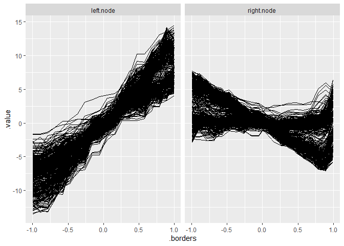

# Install

Install the development version from GitHub:

``` r
remotes::install_github("giuseppec/customtrees")
```

# Objectives

``` r
library(devtools)
load_all()
```

``` r
# objective that fits a constant in the nodes (CART) 
SS = function(x, y) {
  ypred = mean(y)
  sum((y - ypred)^2)
}

# objective that fits a linear model in the nodes (mob)
SS_lm = function(x, y) {
  ypred = predict(lm(y ~ x))
  sum((y - ypred)^2)
}

# objective for multivariate targets (multivariate tree), see MultivariateRandomForest::Node_cost function
SS_multi = function(x, y, cov) {
  center = colMeans(y)
  # cov = cov(y) we need to pass the cov of all data
  sum(mahalanobis(y, center = center, cov = cov, tol = 1e-30))
}
```

# Current TODOs

  - Check if splits on categorical variables works and implement it
  - `split_optimizer` currently uses slow simulated annealing, might be
    improvable

# CART with binary splits (constant model in node)

``` r
nsim = 1000L
x = x = sort(runif(n = nsim, min = 0, max = 2*pi))
q = quantile(x, seq(0, 1, length.out = 100), type = 1)
y = ifelse(x > pi/2, rnorm(nsim, mean = 0), rnorm(nsim, mean = 10, sd = 2))
X = data.frame(x = x)

split = split_parent_node(y, X, objective = SS, optimizer = split_optimizer_exhaustive)
split
```

    ##    feature split.points objective.value
    ## 1:       x     1.590268        2044.898

``` r
# plot result
plot(x, y)
abline(v = split$split.points)
```

<!-- -->

# CART with multiple splits (constant model in node)

``` r
y = ifelse(x < pi/2, rnorm(nsim, mean = 0), 
  ifelse(x < pi, rnorm(nsim, mean = 10, sd = 2), 
    rnorm(nsim, mean = -10, sd = 5)))

split = split_parent_node(y, X, objective = SS, optimizer = split_optimizer, 
  n.splits = 2, control = list(maxit = 5000))
split
```

    ##    feature split.points objective.value
    ## 1:       x     1.505417        14719.45
    ## 2:       x     3.159866        14719.45

``` r
plot(x, y)
abline(v = split$split.points)
```

<!-- -->

# MOB with binary splits (linear model in node)

``` r
y = 4 + 2 * cos(x) + rnorm(nsim, mean = 0, sd = abs(cos(x)) / 2)

split = split_parent_node(y, X, objective = SS_lm, optimizer = split_optimizer_exhaustive, 
  n.splits = 1, control = list(maxit = 1000))
split
```

    ##    feature split.points objective.value
    ## 1:       x     3.159866        140.3408

``` r
plot(x, y)
abline(v = split$split.points)
```

<!-- -->

# MOB with multiple splits (linear model in node)

``` r
y = 4 + 2 * cos(x*2) + rnorm(nsim, mean = 0, sd = abs(cos(x)) / 2)

split = split_parent_node(y, X, objective = SS_lm, optimizer = split_optimizer, 
  n.splits = 3, control = list(maxit = 1000))
split
```

    ##    feature split.points objective.value
    ## 1:       x     1.722640        169.0321
    ## 2:       x     3.236027        169.0321
    ## 3:       x     4.787695        169.0321

``` r
plot(x, y)
abline(v = split$split.points)
```

<!-- -->

# Group ICE Curves with Multivariate Tree (binary splits, constant model in node)

We first generate some functional data:

``` r
# Simulate Data
n = 1000
x1 = runif(n, -1, 1)
x2 = runif(n, -1, 1)
x3 = sample(c(0, 1), size = n, replace = TRUE, prob = c(0.5, 0.5))
x4 = sample(c(0, 1), size = n, replace = TRUE, prob = c(0.7, 0.3))
eps = rnorm(n, 0, 1)

# noisy vars
x5 = sample(c(0, 1), size = n, replace = TRUE, prob = c(0.5, 0.5))
x6 = rnorm(n, mean = 1, sd = 5)

y = 0.2*x1 - 8*x2 + ifelse(x3 == 0, I(16*x2),0) + ifelse(x1 > mean(x1), I(8*x2),0) + eps

dat = data.frame(x1, x2, x3, x4, x5, x6, y)
X = dat[, setdiff(colnames(dat), "y")]

# Fit model and compute ICE for x2
library(iml)
library(ranger)
mod = ranger(y ~ ., data = dat, num.trees = 10)
pred = predict.function = function(model, newdata) predict(model, newdata)$predictions
model = Predictor$new(mod, data = X, y = dat$y, predict.function = pred)
effect = FeatureEffects$new(model, method = "ice", grid.size = 20, features = "x2")

# Plot ICE curves: WE WANT TO FIND SUBGROUPS SUCH THAT ICE KURVES ARE HOMOGENOUS
library(ggplot2)
ggplot(effect$results$x2, aes(x = .borders, y = .value)) + 
  geom_line(aes(group = .id))
```

<!-- -->

Formulate curves above by multivariate target and find feature that
splits the curves such that they are more homogenous in the nodes:

``` r
# Get ICE values and arrange them in a horizontal matrix
library(tidyverse)
Y = spread(effect$results$x2, .borders, .value)
Y = Y[, setdiff(colnames(Y), c(".type", ".id", ".feature"))]
str(X) # contains our feature values
```

    ## 'data.frame':    1000 obs. of  6 variables:
    ##  $ x1: num  -0.155 0.322 -0.849 0.637 0.789 ...
    ##  $ x2: num  -0.862 -0.624 -0.188 0.782 -0.969 ...
    ##  $ x3: num  0 1 1 0 1 1 1 0 1 1 ...
    ##  $ x4: num  0 1 0 0 0 1 0 0 0 0 ...
    ##  $ x5: num  0 1 0 0 0 1 0 1 1 0 ...
    ##  $ x6: num  5.24 7.98 1.01 -3.7 -5.82 ...

``` r
str(Y) # contains ICE values for each grid point
```

    ## 'data.frame':    1000 obs. of  20 variables:
    ##  $ -0.996347735170275 : num  -8.19 0.285 4.818 -10.952 0.666 ...
    ##  $ -0.891456903546656 : num  -7.401 0.126 4.753 -10.323 0.487 ...
    ##  $ -0.786566071923038 : num  -6.4942 0.0211 5.3642 -10.3731 0.2382 ...
    ##  $ -0.681675240299419 : num  -5.116 -0.243 4.865 -9.421 -1.015 ...
    ##  $ -0.576784408675801 : num  -4.438 -0.943 3.133 -7.499 -1.434 ...
    ##  $ -0.471893577052182 : num  -4.015 -0.943 3.482 -5.781 -0.21 ...
    ##  $ -0.367002745428564 : num  -3.909 -0.122 1.448 -5.193 -0.22 ...
    ##  $ -0.262111913804945 : num  -3.383 -0.433 1.407 -4.561 -0.347 ...
    ##  $ -0.157221082181327 : num  -2.081 -0.284 0.928 -1.485 0.456 ...
    ##  $ -0.0523302505577081: num  -1.734 -0.284 1.006 -0.564 0.297 ...
    ##  $ 0.0525605810659104 : num  -1.0066 -0.0526 -0.0878 0.9909 0.025 ...
    ##  $ 0.157451412689529  : num  0.0866 -0.019 -0.8669 1.7487 -0.4287 ...
    ##  $ 0.262342244313147  : num  2.056 -0.609 -1.779 3.401 -1.162 ...
    ##  $ 0.367233075936766  : num  2.221 -0.178 -1.955 5.374 -0.499 ...
    ##  $ 0.472123907560384  : num  2.221 -0.157 -2.615 5.946 -0.365 ...
    ##  $ 0.577014739184003  : num  2.799 -0.358 -3.281 6.553 -0.389 ...
    ##  $ 0.681905570807622  : num  4.236 0.865 -3.185 8.982 -0.313 ...
    ##  $ 0.78679640243124   : num  4.236 0.695 -5.354 9.306 -1.331 ...
    ##  $ 0.891687234054859  : num  4.803 0.374 -4.644 10.949 -0.321 ...
    ##  $ 0.996578065678477  : num  4.79 2.27 -3.63 10.24 1.34 ...

``` r
# compute covariance for data and use this in for mahalanobis distance in the objective
COV = cov(Y)
SS_multi2 = function(x, y) SS_multi(x, y, cov = COV)
sp = split_parent_node(Y = Y, X = X, objective = SS_multi2, 
  n.splits = 1, min.node.size = 1, optimizer = split_optimizer_exhaustive)
sp
```

    ##    feature split.points objective.value
    ## 1:      x1  -0.01498066        19372.42
    ## 2:      x2   0.03784932        19936.75
    ## 3:      x3   0.00000000        19066.63
    ## 4:      x4   0.00000000        19282.92
    ## 5:      x5   0.00000000        19475.43
    ## 6:      x6   9.51962499        19509.92

``` r
# Compare with MultivariateRandomForest yields same result
library(MultivariateRandomForest)
invcov = solve(cov(Y), tol = 1e-30)
sp2 = splitt2(X = as.matrix(X), Y = as.matrix(Y), m_feature = ncol(X), 
  Index = 1:nrow(X), Inv_Cov_Y = invcov, Command = 2, ff = 1:ncol(X))
sp2
```

    ## $Idx_left
    ##   [1]   1   4   8  13  14  16  17  20  21  22  24  26  29  34  36  37  38
    ##  [18]  39  41  42  43  45  46  47  49  50  52  53  54  55  57  58  59  60
    ##  [35]  61  66  68  74  78  80  81  84  87  88  92  96  97 100 101 102 105
    ##  [52] 106 108 109 110 111 112 115 123 125 127 128 129 130 132 133 134 138
    ##  [69] 140 141 146 148 149 152 153 154 155 156 157 159 162 164 168 169 171
    ##  [86] 172 173 174 175 178 180 182 188 189 191 192 194 199 200 202 204 207
    ## [103] 209 210 212 213 218 222 225 229 231 232 234 235 237 240 244 246 249
    ## [120] 251 252 256 257 258 261 262 263 270 272 273 275 279 282 283 284 286
    ## [137] 287 288 293 296 297 298 300 305 307 308 309 310 314 315 319 321 324
    ## [154] 325 326 327 328 330 337 346 347 349 350 351 354 356 357 358 359 361
    ## [171] 365 366 368 369 371 372 374 376 377 379 381 383 384 385 386 389 391
    ## [188] 392 395 397 400 401 402 403 404 407 410 411 412 416 418 419 424 425
    ## [205] 426 427 431 433 434 437 439 441 443 444 445 447 449 452 456 458 460
    ## [222] 462 463 467 468 469 470 475 476 479 480 481 482 484 485 486 487 488
    ## [239] 491 495 499 506 509 510 511 514 515 517 518 522 525 526 528 529 530
    ## [256] 531 532 536 539 542 546 549 558 559 560 561 562 564 568 569 573 574
    ## [273] 577 579 580 581 582 586 592 594 596 600 603 604 605 606 607 608 609
    ## [290] 613 616 617 618 619 620 621 627 628 632 635 636 637 639 640 641 642
    ## [307] 644 645 647 648 649 656 659 660 664 667 669 670 672 674 675 676 682
    ## [324] 685 686 688 689 690 692 693 698 702 703 704 707 708 709 710 711 713
    ## [341] 715 716 720 721 723 729 731 732 736 738 739 741 743 744 745 747 751
    ## [358] 752 753 754 755 756 757 760 762 764 767 769 775 777 778 779 780 782
    ## [375] 784 785 786 787 789 790 791 792 793 796 797 801 804 806 811 813 814
    ## [392] 815 816 817 818 819 820 824 826 827 828 829 832 835 838 841 844 847
    ## [409] 848 850 851 852 855 857 860 861 862 867 868 870 875 878 880 881 882
    ## [426] 884 888 890 892 895 896 898 901 904 905 906 909 910 913 918 919 920
    ## [443] 922 924 929 932 933 934 936 937 939 940 941 943 944 945 950 954 958
    ## [460] 961 967 969 971 972 973 975 976 978 979 980 982 984 988 989 990 991
    ## [477] 992 994 995 996
    ## 
    ## $Idx_right
    ##   [1]    2    3    5    6    7    9   10   11   12   15   18   19   23   25
    ##  [15]   27   28   30   31   32   33   35   40   44   48   51   56   62   63
    ##  [29]   64   65   67   69   70   71   72   73   75   76   77   79   82   83
    ##  [43]   85   86   89   90   91   93   94   95   98   99  103  104  107  113
    ##  [57]  114  116  117  118  119  120  121  122  124  126  131  135  136  137
    ##  [71]  139  142  143  144  145  147  150  151  158  160  161  163  165  166
    ##  [85]  167  170  176  177  179  181  183  184  185  186  187  190  193  195
    ##  [99]  196  197  198  201  203  205  206  208  211  214  215  216  217  219
    ## [113]  220  221  223  224  226  227  228  230  233  236  238  239  241  242
    ## [127]  243  245  247  248  250  253  254  255  259  260  264  265  266  267
    ## [141]  268  269  271  274  276  277  278  280  281  285  289  290  291  292
    ## [155]  294  295  299  301  302  303  304  306  311  312  313  316  317  318
    ## [169]  320  322  323  329  331  332  333  334  335  336  338  339  340  341
    ## [183]  342  343  344  345  348  352  353  355  360  362  363  364  367  370
    ## [197]  373  375  378  380  382  387  388  390  393  394  396  398  399  405
    ## [211]  406  408  409  413  414  415  417  420  421  422  423  428  429  430
    ## [225]  432  435  436  438  440  442  446  448  450  451  453  454  455  457
    ## [239]  459  461  464  465  466  471  472  473  474  477  478  483  489  490
    ## [253]  492  493  494  496  497  498  500  501  502  503  504  505  507  508
    ## [267]  512  513  516  519  520  521  523  524  527  533  534  535  537  538
    ## [281]  540  541  543  544  545  547  548  550  551  552  553  554  555  556
    ## [295]  557  563  565  566  567  570  571  572  575  576  578  583  584  585
    ## [309]  587  588  589  590  591  593  595  597  598  599  601  602  610  611
    ## [323]  612  614  615  622  623  624  625  626  629  630  631  633  634  638
    ## [337]  643  646  650  651  652  653  654  655  657  658  661  662  663  665
    ## [351]  666  668  671  673  677  678  679  680  681  683  684  687  691  694
    ## [365]  695  696  697  699  700  701  705  706  712  714  717  718  719  722
    ## [379]  724  725  726  727  728  730  733  734  735  737  740  742  746  748
    ## [393]  749  750  758  759  761  763  765  766  768  770  771  772  773  774
    ## [407]  776  781  783  788  794  795  798  799  800  802  803  805  807  808
    ## [421]  809  810  812  821  822  823  825  830  831  833  834  836  837  839
    ## [435]  840  842  843  845  846  849  853  854  856  858  859  863  864  865
    ## [449]  866  869  871  872  873  874  876  877  879  883  885  886  887  889
    ## [463]  891  893  894  897  899  900  902  903  907  908  911  912  914  915
    ## [477]  916  917  921  923  925  926  927  928  930  931  935  938  942  946
    ## [491]  947  948  949  951  952  953  955  956  957  959  960  962  963  964
    ## [505]  965  966  968  970  974  977  981  983  985  986  987  993  997  998
    ## [519]  999 1000
    ## 
    ## $Feature_number
    ## [1] 3
    ## 
    ## $Threshold_value
    ## [1] 0.5

Visualize the results:

``` r
best.split = which.min(sp$objective.value)
best.feature = sp$feature[best.split]
best.point = sp$split.points[best.split]

left.node = X[, best.feature] <= best.point
right.node = !left.node


plot.data = effect$results$x2
plot.data$.split = as.factor(ifelse(plot.data$.id %in% which(left.node), "left.node", "right.node"))

ggplot(plot.data, aes(x = .borders, y = .value)) + 
  geom_line(aes(group = .id)) + facet_grid(~ .split)
```

<!-- -->
