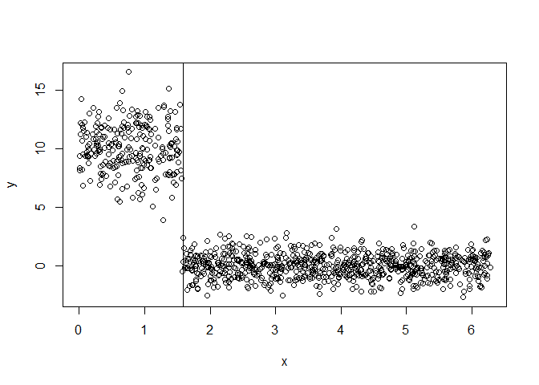
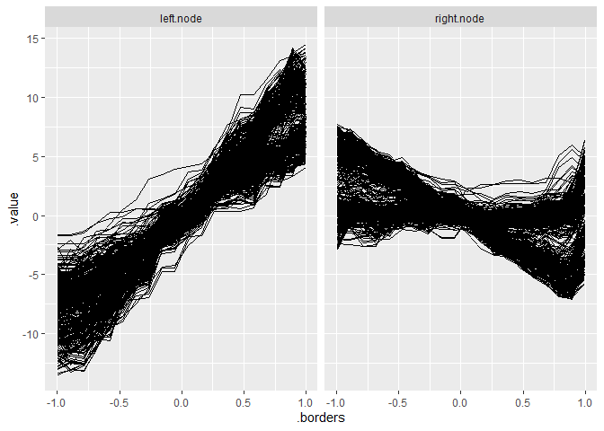

# Install

Install the development version from GitHub:

``` r
remotes::install_github("giuseppec/customtrees")
```

# Objectives

``` r
library(devtools)
library(tidyverse)
library(Rmalschains)
library(iml)
library(ranger)
library(kmlShape)
library(dtw)
load_all()
```

``` r
# objective that fits a constant in the nodes (CART) 
SS = function(x, y) {
  ypred = mean(y)
  sum((y - ypred)^2)
}

# objective that fits a linear model in the nodes (mob)
SS_lm = function(x, y) {
  ypred = predict(lm(y ~ x))
  sum((y - ypred)^2)
}

# objective for multivariate targets (multivariate tree), see MultivariateRandomForest::Node_cost function
SS_mah = function(x, y, cov) {
  center = colMeans(y)
  # cov = cov(y) we need to pass the cov of all data
  sum(mahalanobis(y, center = center, cov = cov, tol = 1e-30))
}

# Frechet distance FDA measure
SS_fre = function(x, y) { # slow
  # using only y-axis of curves is enough as x-axis is always the same for all curves
  require(kmlShape)
  center = colMeans(y)
  grid.x = as.numeric(names(center))
  pdp.y = unname(center)
  dist = apply(y, 1, function(ice) distFrechet(grid.x, pdp.y, grid.x, ice, FrechetSumOrMax = "sum"))
  sum(dist)
}

# Dynamic time warping FDA measure
SS_dtw = function(x, y) {
  require(dtw)
  pdp = colMeans(y) # this is the pdp
  dist = apply(y, 1, function(ice) dtw(ice, pdp, distance.only = TRUE)$normalizedDistance)
  sum(dist)
}
```

# Notes

  - This package is not intended to be fast. It serves as a modular
    framework and playground to explore/study the splitting of features
    by custom objectives.
  - Splits for categorical variables currently not implemented and
    tested. Try to handle categoricals as numerics as workaround.
  - The `perform_split` function computes (and aggregates) the objective
    in the generated nodes after splitting w.r.t. specific split points.
  - Binary splits generate two nodes and are implemented in
    `find_best_binary_split`. The implementation does exhaustive search
    of split point candidates to find the best split point for a given
    feature.
  - Multiple splits generate multiple nodes and are implemented in
    `find_best_multiway_split`. The implementation currently uses a slow
    simulated annealing optimization to find the best split point for a
    given feature (might be improved and replaced with other, faster
    optimization procedures).

# CART with binary splits (constant model in node)

``` r
nsim = 1000L
x = x = sort(runif(n = nsim, min = 0, max = 2*pi))
q = quantile(x, seq(0, 1, length.out = 100), type = 1)
y = ifelse(x > pi/2, rnorm(nsim, mean = 0), rnorm(nsim, mean = 10, sd = 2))
X = data.frame(x = x)

split = split_parent_node(y, X, objective = SS, optimizer = find_best_binary_split)
split
```

    ##    feature objective.value split.points best.split
    ## 1:       x        1900.012     1.547843       TRUE

``` r
# plot result
plot(x, y)
abline(v = unlist(split$split.points))
```

<!-- -->

# CART with multiple splits (constant model in node)

``` r
y = ifelse(x < pi/2, rnorm(nsim, mean = 0), 
  ifelse(x < pi, rnorm(nsim, mean = 10, sd = 2), 
    rnorm(nsim, mean = -10, sd = 5)))

# Simulated annealing from find_best_multiway_split
split = split_parent_node(y, X, objective = SS, optimizer = find_best_multiway_split, 
  n.splits = 2, control = list(maxit = 1000))

# MA-LS Chains optimization from find_best_multiway_split2 (claimed to be faster and better)
split2 = split_parent_node(y, X, objective = SS, optimizer = find_best_multiway_split2, 
  n.splits = 2, control = malschains.control(istep = 100, ls = "sw"))

split
```

    ##    feature objective.value      split.points best.split
    ## 1:       x        12695.16 1.571378,3.142373       TRUE

``` r
split2
```

    ##    feature objective.value      split.points best.split
    ## 1:       x        12695.16 1.573755,3.136344       TRUE

``` r
plot(x, y)
abline(v = unlist(split$split.points))
```

<!-- -->

# MOB with binary splits (linear model in node)

``` r
y = 4 + 2 * cos(x) + rnorm(nsim, mean = 0, sd = abs(cos(x)) / 2)

split = split_parent_node(y, X, objective = SS_lm, optimizer = find_best_binary_split, n.splits = 1)
split
```

    ##    feature objective.value split.points best.split
    ## 1:       x        148.9909     3.118802       TRUE

``` r
plot(x, y)
abline(v = unlist(split$split.points))
```

<!-- -->

# MOB with multiple splits (linear model in node)

``` r
y = 4 + 2 * cos(x*2) + rnorm(nsim, mean = 0, sd = abs(cos(x)) / 2)

split = split_parent_node(y, X, objective = SS_lm, optimizer = find_best_multiway_split2, 
  n.splits = 3, control = malschains.control(istep = 100, ls = "sw"))
split
```

    ##    feature objective.value               split.points best.split
    ## 1:       x         150.879 1.574027,3.166505,4.711258       TRUE

``` r
plot(x, y)
abline(v = unlist(split$split.points))
```

<!-- -->

# Group ICE Curves with Multivariate Tree (binary splits, constant model in node)

We first generate some functional data:

``` r
# Simulate Data
n = 500
x1 = runif(n, -1, 1)
x2 = runif(n, -1, 1)
x3 = sample(c(0, 1), size = n, replace = TRUE, prob = c(0.5, 0.5))
x4 = sample(c(0, 1), size = n, replace = TRUE, prob = c(0.7, 0.3))
eps = rnorm(n, 0, 1)

# noisy vars
x5 = sample(c(0, 1), size = n, replace = TRUE, prob = c(0.5, 0.5))
x6 = rnorm(n, mean = 1, sd = 5)

y = 0.2*x1 - 8*x2 + ifelse(x3 == 0, I(16*x2),0) + ifelse(x1 > mean(x1), I(8*x2),0) + eps
# We also get interesting results using a 2-way interaction of numeric features
# y = 0.2*x1 - 8*x2 + 8*x6*x2 + eps

dat = data.frame(x1, x2, x3, x4, x5, x6, y)
X = dat[, setdiff(colnames(dat), "y")]

# Fit model and compute ICE for x2
mod = ranger(y ~ ., data = dat, num.trees = 10)
pred = predict.function = function(model, newdata) predict(model, newdata)$predictions
model = Predictor$new(mod, data = X, y = dat$y, predict.function = pred)
effect = FeatureEffects$new(model, method = "ice", grid.size = 20, features = "x2")

# Plot ICE curves: WE WANT TO FIND SUBGROUPS SUCH THAT ICE KURVES ARE HOMOGENOUS
ggplot(effect$results$x2, aes(x = .borders, y = .value)) + 
  geom_line(aes(group = .id))
```

<!-- -->

Formulate curves above by multivariate target and find feature that
splits the curves such that they are more homogenous in the nodes:

``` r
# Get ICE values and arrange them in a horizontal matrix
Y = spread(effect$results$x2, .borders, .value)
Y = Y[, setdiff(colnames(Y), c(".type", ".id", ".feature"))]
str(X) # contains our feature values
```

    ## 'data.frame':    500 obs. of  6 variables:
    ##  $ x1: num  -0.647 0.265 -0.577 -0.184 0.395 ...
    ##  $ x2: num  -0.321 -0.428 0.615 -0.731 -0.29 ...
    ##  $ x3: num  1 1 1 0 1 1 0 0 0 1 ...
    ##  $ x4: num  0 0 0 0 0 1 1 0 0 0 ...
    ##  $ x5: num  1 0 1 0 1 0 1 1 1 1 ...
    ##  $ x6: num  -4.967 0.803 0.387 7.317 -3.323 ...

``` r
str(Y) # contains ICE values for each grid point
```

    ## 'data.frame':    500 obs. of  20 variables:
    ##  $ -0.999021098483354 : num  5.06 -1.9 5.06 -9.13 -3.02 ...
    ##  $ -0.894629949140117 : num  4.534 0.437 4.534 -7.547 0.111 ...
    ##  $ -0.790238799796881 : num  3.6623 0.57 3.2837 -5.0754 0.0437 ...
    ##  $ -0.685847650453644 : num  3.5118 0.9087 3.1332 -5.0871 0.0437 ...
    ##  $ -0.581456501110408 : num  2.688 0.786 2.309 -4.91 -0.202 ...
    ##  $ -0.477065351767171 : num  2.559 0.168 1.829 -2.94 0.306 ...
    ##  $ -0.372674202423935 : num  1.837 0.188 1.107 -2.319 0.282 ...
    ##  $ -0.268283053080698 : num  1.837 0.352 1.107 -2.166 0.592 ...
    ##  $ -0.163891903737462 : num  0.866 0.269 0.137 -1.452 0.508 ...
    ##  $ -0.0595007543942254: num  0.386 0.269 -0.343 -1.452 0.508 ...
    ##  $ 0.0448903949490111 : num  -0.269 0.1988 -0.7547 -0.0542 1.2037 ...
    ##  $ 0.149281544292248  : num  -1.546 -0.241 -2.121 1.544 0.287 ...
    ##  $ 0.253672693635484  : num  -1.77248 -0.37912 -2.29604 2.30699 -0.00779 ...
    ##  $ 0.358063842978721  : num  -2.0645 -0.3611 -2.296 2.307 0.0987 ...
    ##  $ 0.462454992321957  : num  -2.29 -0.1334 -3.083 3.3045 0.0511 ...
    ##  $ 0.566846141665194  : num  -3.017 -0.522 -3.971 3.305 -0.909 ...
    ##  $ 0.67123729100843   : num  -3.668 -0.576 -4.289 3.305 -0.909 ...
    ##  $ 0.775628440351667  : num  -4.478 -0.422 -5.113 3.305 -0.687 ...
    ##  $ 0.880019589694903  : num  -4.478 -0.607 -5.512 3.305 -0.687 ...
    ##  $ 0.98441073903814   : num  -4.7436 -0.087 -5.7773 4.5077 -0.0826 ...

``` r
# compute covariance for data and use this in for mahalanobis distance in the objective
COV = cov(Y)
SS_mah2 = function(x, y) SS_mah(x, y, cov = COV)
sp = split_parent_node(Y = Y, X = X, objective = SS_mah2, 
  n.splits = 1, optimizer = find_best_binary_split)
sp
```

    ##    feature objective.value split.points best.split
    ## 1:      x1        9636.199 -0.009225438      FALSE
    ## 2:      x2        9937.148   -0.3834778      FALSE
    ## 3:      x3        9510.825          0.5       TRUE
    ## 4:      x4        9702.706          0.5      FALSE
    ## 5:      x5        9749.055          0.5      FALSE
    ## 6:      x6        9649.767     3.248445      FALSE

``` r
node_index = generate_node_index(Y, X, result = sp)
str(node_index)
```

    ## List of 2
    ##  $ class: Factor w/ 2 levels "[0,0.5]","(0.5,1]": 2 2 2 1 2 2 1 1 1 2 ...
    ##  $ index:List of 2
    ##   ..$ [0,0.5]: int [1:253] 4 7 8 9 11 13 14 15 16 17 ...
    ##   ..$ (0.5,1]: int [1:247] 1 2 3 5 6 10 12 19 24 28 ...

``` r
# frechet distance yields same splits but is a bit slower
sp_frechet = split_parent_node(Y = Y, X = X, objective = SS_fre,
  n.splits = 1, optimizer = find_best_binary_split)
sp_frechet
```

    ##    feature objective.value split.points best.split
    ## 1:      x1        27845.54   -0.5550679      FALSE
    ## 2:      x2        28590.07    0.5268106      FALSE
    ## 3:      x3        10634.18          0.5       TRUE
    ## 4:      x4        28714.65          0.5      FALSE
    ## 5:      x5        28630.77          0.5      FALSE
    ## 6:      x6        28217.97     4.755629      FALSE

``` r
node_index_frechet = generate_node_index(Y, X, result = sp_frechet)
str(node_index_frechet)
```

    ## List of 2
    ##  $ class: Factor w/ 2 levels "[0,0.5]","(0.5,1]": 2 2 2 1 2 2 1 1 1 2 ...
    ##  $ index:List of 2
    ##   ..$ [0,0.5]: int [1:253] 4 7 8 9 11 13 14 15 16 17 ...
    ##   ..$ (0.5,1]: int [1:247] 1 2 3 5 6 10 12 19 24 28 ...

``` r
## dynamic time warping distance yields same splits but is much slower
# sp_dtw = split_parent_node(Y = Y, X = X, objective = SS_dtw, 
#   n.splits = 1, optimizer = find_best_binary_split)
# sp_dtw
# node_index_dtw = generate_node_index(Y, X, result = sp_dtw)
# str(node_index_dtw)
```

``` r
# Compare with MultivariateRandomForest yields same result
library(MultivariateRandomForest)
invcov = solve(cov(Y), tol = 1e-30)
sp2 = splitt2(X = as.matrix(X), Y = as.matrix(Y), m_feature = ncol(X), 
  Index = 1:nrow(X), Inv_Cov_Y = invcov, Command = 2, ff = 1:ncol(X))
str(sp2)
```

    ## List of 4
    ##  $ Idx_left       : int [1:253] 4 7 8 9 11 13 14 15 16 17 ...
    ##  $ Idx_right      : int [1:247] 1 2 3 5 6 10 12 19 24 28 ...
    ##  $ Feature_number : int 3
    ##  $ Threshold_value: num 0.5

Visualize the results:

``` r
plot.data = effect$results$x2
plot.data$.split = node_index$class[plot.data$.id]

ggplot(plot.data, aes(x = .borders, y = .value)) + 
  geom_line(aes(group = .id)) + facet_grid(~ .split)
```

<!-- -->

# Group ICE Curves with Multivariate Tree (multiway splits, constant model in node)

Multiway split **fails** with `SS_mah2` (mahalanobis distance) as
objective. This is because the curve structure along the x-axis is not
considered in the distance calculation\!

``` r
sp_multiway = split_parent_node(Y = Y, X = X, objective = SS_mah2, 
  n.splits = 2, optimizer = find_best_multiway_split2)
sp_multiway
```

    ##    feature objective.value          split.points best.split
    ## 1:      x1        9413.969 -0.4695620,-0.0170989       TRUE
    ## 2:      x2        9896.289 -0.3247722, 0.9826716      FALSE
    ## 3:      x3        9510.825                   0.5      FALSE
    ## 4:      x4        9702.706                   0.5      FALSE
    ## 5:      x5        9749.055                   0.5      FALSE
    ## 6:      x6        9431.491 0.06350918,7.00636083      FALSE

``` r
node_index_multiway = generate_node_index(Y, X, result = sp_multiway)
str(node_index_multiway)
```

    ## List of 2
    ##  $ class: Factor w/ 3 levels "[-0.996,-0.47]",..: 1 3 1 2 3 3 3 3 3 3 ...
    ##  $ index:List of 3
    ##   ..$ [-0.996,-0.47] : int [1:132] 1 3 12 14 24 30 34 35 36 37 ...
    ##   ..$ (-0.47,-0.0171]: int [1:129] 4 11 13 16 17 18 19 21 23 31 ...
    ##   ..$ (-0.0171,0.994]: int [1:239] 2 5 6 7 8 9 10 15 20 22 ...

``` r
plot.data$.split = node_index_multiway$class[plot.data$.id]

ggplot(plot.data, aes(x = .borders, y = .value)) + 
  geom_line(aes(group = .id)) + facet_grid(~ .split)
```

<!-- -->

Instead, using a distance measure that is suited for curves (e.g.,
frechet distance) works:

``` r
sp_multiway_frechet = split_parent_node(Y = Y, X = X, objective = SS_fre, 
  n.splits = 2, optimizer = find_best_multiway_split2)
sp_multiway_frechet
```

    ##    feature objective.value            split.points best.split
    ## 1:      x1        27650.93   -0.5869006,-0.5481744      FALSE
    ## 2:      x2        28271.40 0.003975611,0.026587118      FALSE
    ## 3:      x3        10634.18                     0.5       TRUE
    ## 4:      x4        28714.65                     0.5      FALSE
    ## 5:      x5        28630.77                     0.5      FALSE
    ## 6:      x6        27989.76       4.729784,9.913726      FALSE

``` r
node_index_multiway_frechet = generate_node_index(Y, X, result = sp_multiway_frechet)
str(node_index_multiway_frechet)
```

    ## List of 2
    ##  $ class: Factor w/ 2 levels "[0,0.5]","(0.5,1]": 2 2 2 1 2 2 1 1 1 2 ...
    ##  $ index:List of 2
    ##   ..$ [0,0.5]: int [1:253] 4 7 8 9 11 13 14 15 16 17 ...
    ##   ..$ (0.5,1]: int [1:247] 1 2 3 5 6 10 12 19 24 28 ...

``` r
plot.data$.split = node_index_multiway_frechet$class[plot.data$.id]

ggplot(plot.data, aes(x = .borders, y = .value)) + 
  geom_line(aes(group = .id)) + facet_grid(~ .split)
```

<!-- -->
