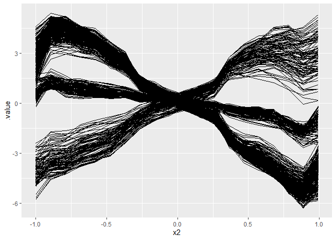
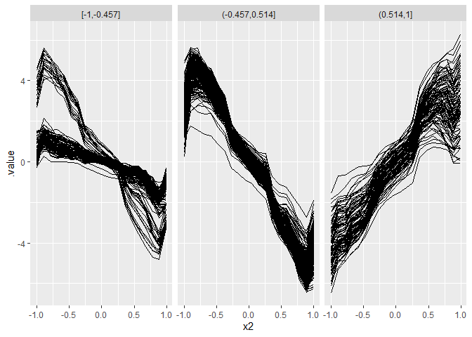

# Install

To make use of functions from this package, you need to clone this
repository, install the `devtools` R package, navigate to the directory
of this package and use the `load_all()` function.

    # install.packages("devtools")
    library(devtools)
    load_all()

Install the development version from GitHub:

    # Currently, documentation is missing. Hence, installation may fail
    # remotes::install_github("giuseppec/customtrees")

# Notes

-   This package is not intended to be fast. It serves as a modular
    framework and playground to explore/study the splitting of features
    by custom objectives.
-   Currently only trees of depth 1 are fitted with `split_parent_node`.
    If you want a tree, you need to call this function recursively on
    the generated child nodes. You can use `generate_node_index` to get
    the split indices of the observations from the current node.
-   Splits for categorical variables currently not implemented and
    tested. Try to handle categoricals as numerics as workaround.
-   The `perform_split` function computes (and aggregates) the objective
    in the generated nodes after splitting w.r.t. specific split points.
-   Binary splits generate two nodes and are implemented in
    `find_best_binary_split`. The implementation does exhaustive search
    of split point candidates to find the best split point for a given
    feature.
-   Multiple splits generate multiple nodes and are implemented in
    `find_best_multiway_split`. The implementation currently uses a slow
    simulated annealing optimization to find the best split point for a
    given feature (might be improved and replaced with other, faster
    optimization procedures).

# Define Objectives used as Split Criteria

    library(tidyverse)
    library(Rmalschains)
    library(dfoptim)
    library(iml)
    library(ranger)
    library(kmlShape)
    library(dtw)

    # objective that fits a constant in the nodes (CART) 
    SS = function(y, x, requires.x = FALSE, ...) {
      ypred = mean(y)
      sum((y - ypred)^2)
    }

    # objective that fits a linear model in the nodes (mob)
    SS_lm = function(y, x, requires.x = TRUE, ...) {
      ypred = predict(lm(y ~ x))
      sum((y - ypred)^2)
    }

    # point-wise L1 distance (is this frechet distance if grids are the same?)
    SS_L1 = function(y, x, requires.x = FALSE, ...) {
      require(Rfast)
      ypred = Rfast::colMedians(as.matrix(y))
      sum(t(abs(t(y) - ypred)))
    }

    # point-wise L2 distance
    SS_L2 = function(y, x, requires.x = FALSE, ...) {
      ypred = colMeans(y)
      sum(t((t(y) - ypred)^2))
    }

    # # point-wise L1 distance = frechet distance if grids are the same
    # SS_L1 = function(y, x, requires.x = FALSE, ...) {
    #   n = nrow(y)
    #   center = colMeans(y)
    #   centermat = t(replicate(n, center))
    #   sum(abs(y - centermat))
    # }

    # Frechet distance FDA measure
    SS_fre = function(y, x, requires.x = FALSE, ...) { # slow
      # using only y-axis of curves is enough as x-axis is always the same for all curves
      require(kmlShape)
      center = colMeans(y)
      grid.x = as.numeric(names(center))
      pdp.y = unname(center)
      dist = apply(y, 1, function(ice) distFrechet(grid.x, pdp.y, grid.x, ice, FrechetSumOrMax = "sum"))
      sum(dist)
    }

    # Dynamic time warping FDA measure
    SS_dtw = function(y, x, requires.x = FALSE, ...) {
      require(dtw)
      pdp = colMeans(y) # this is the pdp
      dist = apply(y, 1, function(ice) dtw(ice, pdp, distance.only = TRUE)$normalizedDistance)
      sum(dist)
    }

# CART with binary splits (constant model in node)

    nsim = 1000L
    x = x = sort(runif(n = nsim, min = 0, max = 2*pi))
    q = quantile(x, seq(0, 1, length.out = 100), type = 1)
    y = ifelse(x > pi/2, rnorm(nsim, mean = 0), rnorm(nsim, mean = 10, sd = 2))
    X = data.frame(x = x)

    split = split_parent_node(y, X, objective = SS, optimizer = find_best_binary_split)
    split

    ##    feature objective.value runtime split.points best.split
    ## 1:       x        2113.473    0.16     1.605472       TRUE

    # plot result
    plot(x, y)
    abline(v = unlist(split$split.points))

<!-- -->

# Extending CART to multiple splits (constant model in node)

    y = ifelse(x < pi/2, rnorm(nsim, mean = 0), 
      ifelse(x < pi, rnorm(nsim, mean = 10, sd = 2), 
        rnorm(nsim, mean = -10, sd = 5)))

    # MA-LS Chains
    split = split_parent_node(y, X, objective = SS, 
      optimizer = find_best_multiway_split_mals, n.splits = 2)

    split

    ##    feature objective.value runtime      split.points best.split
    ## 1:       x        14884.64    0.94 1.592668,3.188205       TRUE

    plot(x, y)
    abline(v = unlist(split$split.points))

<!-- -->

# MOB with binary splits (linear model in node)

    y = 4 + 2 * cos(x) + rnorm(nsim, mean = 0, sd = abs(cos(x)) / 2)

    split = split_parent_node(y, X, objective = SS_lm, optimizer = find_best_binary_split, n.splits = 1)
    split

    ##    feature objective.value runtime split.points best.split
    ## 1:       x        157.5399    0.51     3.167946       TRUE

    plot(x, y)
    abline(v = unlist(split$split.points))

<!-- -->

# MOB with multiple splits (linear model in node)

    y = 4 + 2 * cos(x*2) + rnorm(nsim, mean = 0, sd = abs(cos(x)) / 2)

    # MA-LS Chains
    split = split_parent_node(y, X, objective = SS_lm, optimizer = find_best_multiway_split_mals, 
      n.splits = 3)

    split

    ##    feature objective.value runtime               split.points best.split
    ## 1:       x        142.1684       4 1.567564,3.077776,4.699875       TRUE

    plot(x, y)
    abline(v = unlist(split$split.points))

<!-- -->

# Group ICE Curves with Multivariate Tree (binary splits, constant model in node)

We first generate some functional data:

    # Simulate Data
    n = 500
    x1 = round(runif(n, -1, 1), 1)
    x2 = round(runif(n, -1, 1), 3)
    x3 = sample(c(0, 1), size = n, replace = TRUE, prob = c(0.5, 0.5))
    x4 = sample(c(0, 1), size = n, replace = TRUE, prob = c(0.7, 0.3))

    # noisy vars
    x5 = sample(c(0, 1), size = n, replace = TRUE, prob = c(0.5, 0.5))
    x6 = rnorm(n, mean = 1, sd = 5)

    y = 0.2*x1 - 8*x2 + ifelse(x1 < quantile(x1, 0.25), 8*x2, ifelse(x1 > quantile(x1, 0.75), 16*x2, 0))
    #y = 0.2*x1 - 8*x2 + ifelse(x3 == 0, I(16*x2),0) + ifelse(x1 > mean(x1), I(8*x2),0)
    # We also get interesting results using a 2-way interaction of numeric features
    #y = 0.2*x1 - 8*x2 + 8*x6*x2
    #y = 0.2*x1 - 8*x2^2 + 5*cos(x2*5)*x6 + ifelse(x3 == 0, I(8*x2),0)
    eps = rnorm(n, 0, 0.1*sd(y))
    y = y + eps

    dat = data.frame(x1, x2, x3, x4, x5, x6, y)
    X = dat[, setdiff(colnames(dat), "y")]

    # Fit model and compute ICE for x2
    mod = ranger(y ~ ., data = dat, num.trees = 500)
    pred = function(model, newdata) predict(model, newdata)$predictions
    model = Predictor$new(mod, data = X, y = dat$y, predict.function = pred)
    effect = FeatureEffect$new(model, method = "ice", grid.size = 20, feature = "x2")

    eff = as.data.table(effect$results)
    # Center ICE curves
    eff = as.data.frame(eff[, .value := (.value - mean(.value)), by = c(".type", ".id")])

    # Plot ICE curves: WE WANT TO FIND SUBGROUPS SUCH THAT ICE KURVES ARE HOMOGENOUS
    ggplot(eff, aes(x = x2, y = .value)) + 
      geom_line(aes(group = .id))

<!-- -->

Formulate curves above by multivariate target and find feature that
splits the curves such that they are more homogenous in the nodes:

    # Get ICE values and arrange them in a horizontal matrix
    Y = spread(eff, x2, .value)
    Y = Y[, setdiff(colnames(Y), c(".type", ".id"))]

    str(X) # contains our feature values

    ## 'data.frame':    500 obs. of  6 variables:
    ##  $ x1: num  -0.8 1 -0.4 -0.6 -0.2 0.5 0.4 0.5 0.5 -0.6 ...
    ##  $ x2: num  0.473 0.935 0.944 0.154 -0.602 -0.266 -0.912 0.958 -0.777 -0.846 ...
    ##  $ x3: num  1 0 1 1 0 1 1 1 1 0 ...
    ##  $ x4: num  0 0 0 0 1 1 1 0 0 0 ...
    ##  $ x5: num  0 1 0 1 1 0 1 0 0 0 ...
    ##  $ x6: num  -4.686 2.749 -0.433 -11.956 -0.84 ...

    str(Y) # contains ICE values for each grid point

    ## 'data.frame':    500 obs. of  20 variables:
    ##  $ -1                : num  0.601 -4.296 3.036 0.59 3.474 ...
    ##  $ -0.895157894736842: num  1.47 -4.05 4.76 1.1 4.82 ...
    ##  $ -0.790315789473684: num  1.249 -3.913 4.662 0.834 4.699 ...
    ##  $ -0.685473684210526: num  1.208 -3.597 4.192 0.841 4.394 ...
    ##  $ -0.580631578947368: num  1.16 -3.36 3.97 0.85 4.04 ...
    ##  $ -0.475789473684211: num  1.034 -3.167 3.308 0.812 2.923 ...
    ##  $ -0.370947368421053: num  0.867 -2.395 2.654 0.766 2.506 ...
    ##  $ -0.266105263157895: num  0.624 -1.564 1.475 0.561 1.206 ...
    ##  $ -0.161263157894737: num  0.403 -1.064 0.794 0.411 0.702 ...
    ##  $ -0.056421052631579: num  0.239 -0.666 0.438 0.274 0.239 ...
    ##  $ 0.0484210526315789: num  0.0664 -0.2706 -0.078 0.1342 -0.121 ...
    ##  $ 0.153263157894737 : num  -0.0732 0.0267 -0.651 0.0282 -0.546 ...
    ##  $ 0.258105263157895 : num  -0.06416 0.76146 -0.91594 -0.00355 -0.94999 ...
    ##  $ 0.362947368421052 : num  -0.278 2.513 -2.062 -0.371 -2.211 ...
    ##  $ 0.467789473684211 : num  -0.405 3.156 -2.73 -0.533 -3.177 ...
    ##  $ 0.572631578947368 : num  -0.473 3.681 -2.898 -0.554 -3.771 ...
    ##  $ 0.677473684210526 : num  -1.12 4.01 -3.89 -1.02 -4.3 ...
    ##  $ 0.782315789473684 : num  -1.83 4.33 -5 -1.64 -4.8 ...
    ##  $ 0.887157894736842 : num  -2.3 4.56 -5.93 -1.77 -5.1 ...
    ##  $ 0.992             : num  -2.38 5.31 -5.14 -1.31 -4.02 ...

    sp = split_parent_node(Y = Y, X = X, objective = SS_L2,
      n.splits = 1, optimizer = find_best_binary_split)
    sp

    ##    feature objective.value runtime split.points best.split
    ## 1:      x1        20615.92    0.05         0.55       TRUE
    ## 2:      x2        49944.31    0.13       -0.899      FALSE
    ## 3:      x3        50389.03    0.01          0.5      FALSE
    ## 4:      x4        50439.39    0.00          0.5      FALSE
    ## 5:      x5        50353.81    0.00          0.5      FALSE
    ## 6:      x6        49231.41    0.22   -0.5898811      FALSE

    node_index = generate_node_index(Y, X, result = sp)
    str(node_index)

    ## List of 2
    ##  $ class: Factor w/ 2 levels "[-1,0.55]","(0.55,1]": 1 2 1 1 1 1 1 1 1 1 ...
    ##  $ index:List of 2
    ##   ..$ [-1,0.55]: int [1:397] 1 3 4 5 6 7 8 9 10 11 ...
    ##   ..$ (0.55,1] : int [1:103] 2 17 27 32 36 37 38 46 51 60 ...

Visualize the results:

    plot.data = effect$results
    plot.data$.split = node_index$class[plot.data$.id]

    ggplot(plot.data, aes(x = x2, y = .value)) + 
      geom_line(aes(group = .id)) + facet_grid(~ .split)

<!-- -->

# Group ICE Curves with Multivariate Tree (multiway splits, constant model in node)

<!-- Multiway split **fails** with `SS_mah2` (mahalanobis distance) as objective.  -->
<!-- This is because the curve structure along the x-axis is not considered in the distance calculation! -->
<!-- ```{r} -->
<!-- sp_multiway = split_parent_node(Y = Y, X = X, objective = SS_mah2,  -->
<!--   n.splits = 5, optimizer = find_best_multiway_split) -->
<!-- sp_multiway -->
<!-- node_index_multiway = generate_node_index(Y, X, result = sp_multiway) -->
<!-- str(node_index_multiway) -->
<!-- plot.data$.split = node_index_multiway$class[plot.data$.id] -->
<!-- ggplot(plot.data, aes(x = x2, y = .value)) +  -->
<!--   geom_line(aes(group = .id)) + facet_grid(~ .split) -->
<!-- ``` -->

Multiway splits using a distance measure suited for curves:

    sp_multiway = split_parent_node(Y = Y, X = X, objective = SS_L2, 
      n.splits = 2, optimizer = find_best_multiway_split_mals)
    sp_multiway

    ##    feature objective.value runtime          split.points best.split
    ## 1:      x1        1807.511    1.95 -0.4570238, 0.5144859       TRUE
    ## 2:      x2       49569.425    1.48 -0.7704058,-0.5325179      FALSE
    ## 3:      x3       50389.034    0.00                   0.5      FALSE
    ## 4:      x4       50439.387    0.02                   0.5      FALSE
    ## 5:      x5       50353.813    0.00                   0.5      FALSE
    ## 6:      x6       48944.352    1.59 -0.6257652, 0.2943695      FALSE

    node_index_multiway = generate_node_index(Y, X, result = sp_multiway)
    str(node_index_multiway)

    ## List of 2
    ##  $ class: Factor w/ 3 levels "[-1,-0.457]",..: 1 3 2 1 2 2 2 2 2 1 ...
    ##  $ index:List of 3
    ##   ..$ [-1,-0.457]   : int [1:126] 1 4 10 12 14 15 24 25 28 29 ...
    ##   ..$ (-0.457,0.514]: int [1:271] 3 5 6 7 8 9 11 13 16 18 ...
    ##   ..$ (0.514,1]     : int [1:103] 2 17 27 32 36 37 38 46 51 60 ...

    plot.data$.split = node_index_multiway$class[plot.data$.id]

    ggplot(plot.data, aes(x = x2, y = .value)) + 
      geom_line(aes(group = .id)) + facet_grid(~ .split)

<!-- -->

## Group ICE Curves with Multivariate Tree (multiway splits, constant model in node)

Now, we try a non-linear effect with a continuous interaction effect.

    y = 0.2*x1 - 8*x2^2 + 5*cos(x2*5)*x6 + eps
    dat = data.frame(x1, x2, x3, x4, x5, x6, y)
    X = dat[, setdiff(colnames(dat), "y")]

    # Fit model and compute ICE for x2
    mod = ranger(y ~ ., data = dat, num.trees = 1000)
    pred = function(model, newdata) predict(model, newdata)$predictions
    model = Predictor$new(mod, data = X, y = dat$y, predict.function = pred)
    effect = FeatureEffect$new(model, method = "ice", grid.size = 20, feature = "x2")

    eff = as.data.table(effect$results)
    # Center ICE curves
    eff = as.data.frame(eff[, .value := (.value - mean(.value)), by = c(".type", ".id")])
    Y = spread(eff, x2, .value)
    Y = Y[, setdiff(colnames(Y), c(".type", ".id"))]
    #Y = as.data.frame(t(apply(Y, MARGIN = 1, function(x) x - mean(x))))

    # Plot ICE curves: WE WANT TO FIND SUBGROUPS SUCH THAT ICE KURVES ARE HOMOGENOUS
    ggplot(eff, aes(x = x2, y = .value)) + 
      geom_line(aes(group = .id))

<!-- -->

    sp_multi = lapply(1:4, function(i) {
      split_parent_node(Y = Y, X = X, objective = SS_L2, 
      n.splits = i, optimizer = find_best_multiway_split_mals, min.node.size = 10)
    })
    results = rbindlist(sp_multi, idcol = "n.splits")
    results[results$best.split, ]

    ##    n.splits feature objective.value runtime                            split.points best.split
    ## 1:        1      x6        88235.54    0.12                               0.6014337       TRUE
    ## 2:        2      x6        54962.54    1.59                     -2.444091, 2.989396       TRUE
    ## 3:        3      x6        48116.97    1.83           -2.583962, 1.019968, 4.609502       TRUE
    ## 4:        4      x6        43256.47    2.03 -4.519632,-2.042282, 1.369073, 5.015983       TRUE

    node_index_multiway = generate_node_index(Y, X, result = sp_multi[[length(sp_multi)]])
    str(node_index_multiway)

    ## List of 2
    ##  $ class: Factor w/ 5 levels "[-12.2,-4.52]",..: 1 4 3 1 3 5 3 5 2 4 ...
    ##  $ index:List of 5
    ##   ..$ [-12.2,-4.52]: int [1:85] 1 4 13 20 22 23 25 30 31 36 ...
    ##   ..$ (-4.52,-2.04]: int [1:72] 9 16 26 38 41 42 58 71 75 89 ...
    ##   ..$ (-2.04,1.37] : int [1:124] 3 5 7 11 18 19 24 28 39 43 ...
    ##   ..$ (1.37,5.02]  : int [1:125] 2 10 14 21 33 40 44 53 56 65 ...
    ##   ..$ (5.02,15.3]  : int [1:94] 6 8 12 15 17 27 29 32 34 35 ...

    plot.data = effect$results
    plot.data$.split = node_index_multiway$class[plot.data$.id]

    ggplot(plot.data, aes(x = x2, y = .value)) + 
      geom_line(aes(group = .id)) + facet_grid(~ .split)

<!-- -->
