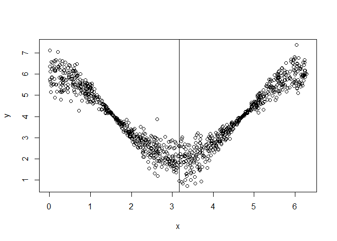

# Install

To make use of functions from this package, you need to clone this
repository, install the `devtools` R package, navigate to the directory
of this package and use the `load_all()` function.

``` r
# install.packages("devtools")
library(devtools)
load_all()
```

Install the development version from GitHub:

``` r
# Currently, documentation is missing. Hence, installation may fail
# remotes::install_github("giuseppec/customtrees")
```

# Notes

  - This package is not intended to be fast. It serves as a modular
    framework and playground to explore/study the splitting of features
    by custom objectives.
  - Currently only trees of depth 1 are fitted with `split_parent_node`.
    If you want a tree, you need to call this function recursively on
    the generated child nodes. You can use `generate_node_index` to get
    the split indices of the observations from the current node.
  - Splits for categorical variables currently not implemented and
    tested. Try to handle categoricals as numerics as workaround.
  - The `perform_split` function computes (and aggregates) the objective
    in the generated nodes after splitting w.r.t. specific split points.
  - Binary splits generate two nodes and are implemented in
    `find_best_binary_split`. The implementation does exhaustive search
    of split point candidates to find the best split point for a given
    feature.
  - Multiple splits generate multiple nodes and are implemented in
    `find_best_multiway_split`. The implementation currently uses a slow
    simulated annealing optimization to find the best split point for a
    given feature (might be improved and replaced with other, faster
    optimization procedures).

# Define Objectives used as Split Criteria

``` r
library(tidyverse)
library(Rmalschains)
library(dfoptim)
library(iml)
library(ranger)
library(kmlShape)
library(dtw)
```

``` r
# objective that fits a constant in the nodes (CART) 
SS = function(y, x, requires.x = FALSE) {
  ypred = mean(y)
  sum((y - ypred)^2)
}

# objective that fits a linear model in the nodes (mob)
SS_lm = function(y, x, requires.x = TRUE) {
  ypred = predict(lm(y ~ x))
  sum((y - ypred)^2)
}

# objective for multivariate targets (multivariate tree), see MultivariateRandomForest::Node_cost function
SS_mah = function(y, x, requires.x = FALSE, cov = NULL) {
  if (is.null(cov))
    cov = cov(y)
  center = colMeans(y)
  # cov = cov(y) we need to pass the cov of all data
  sum(mahalanobis(y, center = center, cov = cov, tol = 1e-30))
}

# point-wise L1 distance (is this frechet distance if grids are the same?)
SS_L1 = function(y, x, requires.x = FALSE) {
  require(Rfast)
  n = nrow(y)
  ypred = Rfast::colMedians(as.matrix(y))
  sum(t(abs(t(y) - ypred)))
}

# point-wise L2 distance
SS_L2 = function(y, x, requires.x = FALSE) {
  n = nrow(y)
  ypred = colMeans(y)
  sum(t((t(y) - ypred)^2))
}

# # point-wise L1 distance = frechet distance if grids are the same
# SS_L1 = function(y, x, requires.x = FALSE) {
#   n = nrow(y)
#   center = colMeans(y)
#   centermat = t(replicate(n, center))
#   sum(abs(y - centermat))
# }

# Frechet distance FDA measure
SS_fre = function(y, x, requires.x = FALSE) { # slow
  # using only y-axis of curves is enough as x-axis is always the same for all curves
  require(kmlShape)
  center = colMeans(y)
  grid.x = as.numeric(names(center))
  pdp.y = unname(center)
  dist = apply(y, 1, function(ice) distFrechet(grid.x, pdp.y, grid.x, ice, FrechetSumOrMax = "sum"))
  sum(dist)
}

# Dynamic time warping FDA measure
SS_dtw = function(y, x, requires.x = FALSE) {
  require(dtw)
  pdp = colMeans(y) # this is the pdp
  dist = apply(y, 1, function(ice) dtw(ice, pdp, distance.only = TRUE)$normalizedDistance)
  sum(dist)
}
```

# CART with binary splits (constant model in node)

``` r
nsim = 1000L
x = x = sort(runif(n = nsim, min = 0, max = 2*pi))
q = quantile(x, seq(0, 1, length.out = 100), type = 1)
y = ifelse(x > pi/2, rnorm(nsim, mean = 0), rnorm(nsim, mean = 10, sd = 2))
X = data.frame(x = x)

split = split_parent_node(y, X, objective = SS, optimizer = find_best_binary_split)
split
```

    ##    feature objective.value runtime split.points best.split
    ## 1:       x        2113.473    0.14     1.605472       TRUE

``` r
# plot result
plot(x, y)
abline(v = unlist(split$split.points))
```

<!-- -->

# Extending CART to multiple splits (constant model in node)

``` r
y = ifelse(x < pi/2, rnorm(nsim, mean = 0), 
  ifelse(x < pi, rnorm(nsim, mean = 10, sd = 2), 
    rnorm(nsim, mean = -10, sd = 5)))

# MA-LS Chains
split = split_parent_node(y, X, objective = SS, 
  optimizer = find_best_multiway_split_mals, n.splits = 2)

split
```

    ##    feature objective.value runtime      split.points best.split
    ## 1:       x        14884.64    0.91 1.592668,3.188205       TRUE

``` r
plot(x, y)
abline(v = unlist(split$split.points))
```

<!-- -->

# MOB with binary splits (linear model in node)

``` r
y = 4 + 2 * cos(x) + rnorm(nsim, mean = 0, sd = abs(cos(x)) / 2)

split = split_parent_node(y, X, objective = SS_lm, optimizer = find_best_binary_split, n.splits = 1)
split
```

    ##    feature objective.value runtime split.points best.split
    ## 1:       x        157.5399    0.47     3.167946       TRUE

``` r
plot(x, y)
abline(v = unlist(split$split.points))
```

<!-- -->

# MOB with multiple splits (linear model in node)

``` r
y = 4 + 2 * cos(x*2) + rnorm(nsim, mean = 0, sd = abs(cos(x)) / 2)

# MA-LS Chains
split = split_parent_node(y, X, objective = SS_lm, optimizer = find_best_multiway_split_mals, 
  n.splits = 3)

split
```

    ##    feature objective.value runtime               split.points best.split
    ## 1:       x        142.1684    4.01 1.567564,3.077776,4.699875       TRUE

``` r
plot(x, y)
abline(v = unlist(split$split.points))
```

<!-- -->

# Group ICE Curves with Multivariate Tree (binary splits, constant model in node)

We first generate some functional data:

``` r
# Simulate Data
n = 500
x1 = round(runif(n, -1, 1), 1)
x2 = round(runif(n, -1, 1), 3)
x3 = sample(c(0, 1), size = n, replace = TRUE, prob = c(0.5, 0.5))
x4 = sample(c(0, 1), size = n, replace = TRUE, prob = c(0.7, 0.3))
eps = rnorm(n, 0, 1)

# noisy vars
x5 = sample(c(0, 1), size = n, replace = TRUE, prob = c(0.5, 0.5))
x6 = rnorm(n, mean = 1, sd = 5)

y = 0.2*x1 - 8*x2 + ifelse(x3 == 0, I(16*x2),0) + ifelse(x1 > mean(x1), I(8*x2),0) + eps
# We also get interesting results using a 2-way interaction of numeric features
#y = 0.2*x1 - 8*x2 + 8*x6*x2 + eps
#y = 0.2*x1 - 8*x2^2 + 5*cos(x2*5)*x6 + ifelse(x3 == 0, I(8*x2),0) + eps

dat = data.frame(x1, x2, x3, x4, x5, x6, y)
X = dat[, setdiff(colnames(dat), "y")]

# Fit model and compute ICE for x2
mod = ranger(y ~ ., data = dat, num.trees = 500)
pred = function(model, newdata) predict(model, newdata)$predictions
model = Predictor$new(mod, data = X, y = dat$y, predict.function = pred)
effect = FeatureEffect$new(model, method = "ice", grid.size = 20, feature = "x2")

eff = as.data.table(effect$results)
# Center ICE curves
eff = as.data.frame(eff[, .value := (.value - mean(.value)), by = c(".type", ".id")])

# Plot ICE curves: WE WANT TO FIND SUBGROUPS SUCH THAT ICE KURVES ARE HOMOGENOUS
ggplot(eff, aes(x = x2, y = .value)) + 
  geom_line(aes(group = .id))
```

<!-- -->

Formulate curves above by multivariate target and find feature that
splits the curves such that they are more homogenous in the nodes:

``` r
# Get ICE values and arrange them in a horizontal matrix
Y = spread(eff, x2, .value)
Y = Y[, setdiff(colnames(Y), c(".type", ".id"))]

str(X) # contains our feature values
```

    ## 'data.frame':    500 obs. of  6 variables:
    ##  $ x1: num  -0.8 1 -0.4 -0.6 -0.2 0.5 0.4 0.5 0.5 -0.6 ...
    ##  $ x2: num  0.473 0.935 0.944 0.154 -0.602 -0.266 -0.912 0.958 -0.777 -0.846 ...
    ##  $ x3: num  1 0 1 1 0 1 1 1 1 0 ...
    ##  $ x4: num  0 0 0 0 1 1 1 0 0 0 ...
    ##  $ x5: num  0 0 0 0 1 1 1 0 0 0 ...
    ##  $ x6: num  -0.114 2.448 -4.638 -2.443 2.93 ...

``` r
str(Y) # contains ICE values for each grid point
```

    ## 'data.frame':    500 obs. of  20 variables:
    ##  $ -1                : num  1.73 -9.58 1.27 1.23 -6.57 ...
    ##  $ -0.895157894736842: num  2.6 -9.49 2.18 2.11 -5.09 ...
    ##  $ -0.790315789473684: num  3.9 -8.45 3.38 3.44 -4.81 ...
    ##  $ -0.685473684210526: num  3.98 -7.78 3.55 3.55 -4.36 ...
    ##  $ -0.580631578947368: num  3.55 -7.29 3.3 3.21 -4.12 ...
    ##  $ -0.475789473684211: num  2.96 -6.21 2.89 2.64 -3.53 ...
    ##  $ -0.370947368421053: num  2.01 -4.95 2.17 1.92 -3 ...
    ##  $ -0.266105263157895: num  1.66 -3.92 1.72 1.49 -2.43 ...
    ##  $ -0.161263157894737: num  1.008 -2.44 1.247 0.965 -1.308 ...
    ##  $ -0.056421052631579: num  -0.2904 -1.5611 -0.0221 -0.2815 -0.9445 ...
    ##  $ 0.0484210526315789: num  -1.134 0.555 -0.728 -1.063 0.413 ...
    ##  $ 0.153263157894737 : num  -1.35 1.529 -0.966 -1.363 0.603 ...
    ##  $ 0.258105263157895 : num  -1.37 2.49 -1.13 -1.32 1.51 ...
    ##  $ 0.362947368421052 : num  -1.94 3.39 -1.79 -1.77 2.38 ...
    ##  $ 0.467789473684211 : num  -2.46 5.42 -2.07 -2.02 3.82 ...
    ##  $ 0.572631578947368 : num  -2.71 7.6 -2.26 -2.09 5.19 ...
    ##  $ 0.677473684210526 : num  -2.41 9.25 -2.29 -1.98 5.74 ...
    ##  $ 0.782315789473684 : num  -3.06 10.44 -2.97 -2.58 5.75 ...
    ##  $ 0.887157894736842 : num  -3.23 11.13 -3.22 -2.69 6.26 ...
    ##  $ 0.992             : num  -3.44 9.86 -4.27 -3.39 4.49 ...

``` r
# compute covariance for data and use this in for mahalanobis distance in the objective
COV = cov(Y)
SS_mah2 = function(y, x, requires.x = FALSE) 
  SS_mah(y = y, x = x, requires.x = requires.x, cov = COV)
sp = split_parent_node(Y = Y, X = X, objective = SS_mah2, 
  n.splits = 1, optimizer = find_best_binary_split)
sp
```

    ##    feature objective.value runtime split.points best.split
    ## 1:      x1        6508.379    0.05        -0.25      FALSE
    ## 2:      x2        6693.714    0.11       0.2795      FALSE
    ## 3:      x3        8763.902    0.00          0.5      FALSE
    ## 4:      x4        6956.781    0.01          0.5      FALSE
    ## 5:      x5        6708.608    0.00          0.5      FALSE
    ## 6:      x6        6208.212    0.16     3.522146       TRUE

``` r
node_index = generate_node_index(Y, X, result = sp)
str(node_index)
```

    ## List of 2
    ##  $ class: Factor w/ 2 levels "[-13.2,3.52]",..: 1 1 1 1 1 1 1 2 1 2 ...
    ##  $ index:List of 2
    ##   ..$ [-13.2,3.52]: int [1:361] 1 2 3 4 5 6 7 9 12 13 ...
    ##   ..$ (3.52,16.3] : int [1:139] 8 10 11 14 18 24 28 30 34 35 ...

``` r
# frechet distance yields same splits but is a bit slower
sp_frechet = split_parent_node(Y = Y, X = X, objective = SS_fre,
  n.splits = 1, optimizer = find_best_binary_split)
sp_frechet
```

    ##    feature objective.value runtime split.points best.split
    ## 1:      x1       23126.947    0.26        -0.75      FALSE
    ## 2:      x2       23073.006    0.75       0.5495      FALSE
    ## 3:      x3        8958.246    0.02          0.5       TRUE
    ## 4:      x4       23165.626    0.03          0.5      FALSE
    ## 5:      x5       23116.535    0.03          0.5      FALSE
    ## 6:      x6       23118.918    0.63     10.21405      FALSE

``` r
node_index_frechet = generate_node_index(Y, X, result = sp_frechet)
str(node_index_frechet)
```

    ## List of 2
    ##  $ class: Factor w/ 2 levels "[0,0.5]","(0.5,1]": 2 1 2 2 1 2 2 2 2 1 ...
    ##  $ index:List of 2
    ##   ..$ [0,0.5]: int [1:257] 2 5 10 11 12 13 16 17 18 19 ...
    ##   ..$ (0.5,1]: int [1:243] 1 3 4 6 7 8 9 14 15 20 ...

``` r
## dynamic time warping distance yields same splits but is much slower
# sp_dtw = split_parent_node(Y = Y, X = X, objective = SS_dtw, 
#   n.splits = 1, optimizer = find_best_binary_split)
# sp_dtw
# node_index_dtw = generate_node_index(Y, X, result = sp_dtw)
# str(node_index_dtw)
```

``` r
# Compare with MultivariateRandomForest yields same result
library(MultivariateRandomForest)
invcov = solve(cov(Y), tol = 1e-30)
sp2 = splitt2(X = as.matrix(X), Y = as.matrix(Y), m_feature = ncol(X), 
  Index = 1:nrow(X), Inv_Cov_Y = invcov, Command = 2, ff = 1:ncol(X))
str(sp2)
```

    ## List of 4
    ##  $ Idx_left       : int [1:82] 304 55 76 53 260 214 361 270 299 435 ...
    ##  $ Idx_right      : int [1:418] 206 342 409 37 183 269 316 397 442 467 ...
    ##  $ Feature_number : int 6
    ##  $ Threshold_value: num -4.12

Visualize the results:

``` r
plot.data = effect$results
plot.data$.split = node_index_frechet$class[plot.data$.id]

ggplot(plot.data, aes(x = x2, y = .value)) + 
  geom_line(aes(group = .id)) + facet_grid(~ .split)
```

<!-- -->

# Group ICE Curves with Multivariate Tree (multiway splits, constant model in node)

Multiway split **fails** with `SS_mah2` (mahalanobis distance) as
objective. This is because the curve structure along the x-axis is not
considered in the distance calculation\!

``` r
sp_multiway = split_parent_node(Y = Y, X = X, objective = SS_mah2, 
  n.splits = 5, optimizer = find_best_multiway_split)
sp_multiway
```

    ##    feature objective.value runtime                                                     split.points best.split
    ## 1:      x1        5945.708    3.04      -0.29110513,-0.07112716, 0.16457517, 0.25492628, 0.67804064      FALSE
    ## 2:      x2        6318.039    2.67 -0.412011772,-0.237854306,-0.021853915, 0.005919518, 0.744209572      FALSE
    ## 3:      x3        8763.902    0.02                                                              0.5      FALSE
    ## 4:      x4        6956.781    0.00                                                              0.5      FALSE
    ## 5:      x5        6708.608    0.02                                                              0.5      FALSE
    ## 6:      x6        5643.052    3.32      -3.02324571,-0.07438653, 1.80379538, 4.99053197, 7.30506479       TRUE

``` r
node_index_multiway = generate_node_index(Y, X, result = sp_multiway)
str(node_index_multiway)
```

    ## List of 2
    ##  $ class: Factor w/ 6 levels "[-13.2,-3.02]",..: 2 4 1 2 4 2 2 5 4 4 ...
    ##  $ index:List of 6
    ##   ..$ [-13.2,-3.02]  : int [1:102] 3 15 21 23 32 33 37 43 47 50 ...
    ##   ..$ (-3.02,-0.0744]: int [1:120] 1 4 6 7 12 13 22 26 29 38 ...
    ##   ..$ (-0.0744,1.8]  : int [1:76] 17 19 25 31 48 49 52 59 67 70 ...
    ##   ..$ (1.8,4.99]     : int [1:111] 2 5 9 10 16 20 24 27 30 40 ...
    ##   ..$ (4.99,7.31]    : int [1:35] 8 11 14 34 36 64 65 77 85 109 ...
    ##   ..$ (7.31,16.3]    : int [1:56] 18 28 35 39 42 51 62 63 66 81 ...

``` r
plot.data$.split = node_index_multiway$class[plot.data$.id]

ggplot(plot.data, aes(x = x2, y = .value)) + 
  geom_line(aes(group = .id)) + facet_grid(~ .split)
```

<!-- -->

Instead, using a distance measure that is suited for curves (e.g.,
frechet distance) works:

``` r
sp_multiway_frechet = split_parent_node(Y = Y, X = X, objective = SS_L1, 
  n.splits = 5, optimizer = find_best_multiway_split_mals)
sp_multiway_frechet
```

    ##    feature objective.value runtime                                                split.points best.split
    ## 1:      x1        26380.41    2.47 -0.79959517,-0.09309034, 0.02778196, 0.42654583, 0.91347557      FALSE
    ## 2:      x2        26737.43    2.48 -0.65945636,-0.42067981,-0.11334743, 0.02222543, 0.53222254      FALSE
    ## 3:      x3        12435.55    0.00                                                         0.5       TRUE
    ## 4:      x4        27577.58    0.00                                                         0.5      FALSE
    ## 5:      x5        27256.58    0.00                                                         0.5      FALSE
    ## 6:      x6        26332.35    2.53      -5.9682952,-1.3440609,-0.8984664, 0.9986572, 8.3414951      FALSE

``` r
node_index_multiway_frechet = generate_node_index(Y, X, result = sp_multiway_frechet)
str(node_index_multiway_frechet)
```

    ## List of 2
    ##  $ class: Factor w/ 2 levels "[0,0.5]","(0.5,1]": 2 1 2 2 1 2 2 2 2 1 ...
    ##  $ index:List of 2
    ##   ..$ [0,0.5]: int [1:257] 2 5 10 11 12 13 16 17 18 19 ...
    ##   ..$ (0.5,1]: int [1:243] 1 3 4 6 7 8 9 14 15 20 ...

``` r
plot.data$.split = node_index_multiway_frechet$class[plot.data$.id]

ggplot(plot.data, aes(x = x2, y = .value)) + 
  geom_line(aes(group = .id)) + facet_grid(~ .split)
```

<!-- -->

## Group ICE Curves with Multivariate Tree (multiway splits, constant model in node)

Now, we try a non-linear effect with a continous interaction effect.

``` r
y = 0.2*x1 - 8*x2^2 + 5*cos(x2*5)*x6 + eps
dat = data.frame(x1, x2, x3, x4, x5, x6, y)
X = dat[, setdiff(colnames(dat), "y")]

# Fit model and compute ICE for x2
mod = ranger(y ~ ., data = dat, num.trees = 1000)
pred = function(model, newdata) predict(model, newdata)$predictions
model = Predictor$new(mod, data = X, y = dat$y, predict.function = pred)
effect = FeatureEffect$new(model, method = "ice", grid.size = 20, feature = "x2")

eff = as.data.table(effect$results)
# Center ICE curves
eff = as.data.frame(eff[, .value := (.value - mean(.value)), by = c(".type", ".id")])
Y = spread(eff, x2, .value)
Y = Y[, setdiff(colnames(Y), c(".type", ".id"))]
#Y = as.data.frame(t(apply(Y, MARGIN = 1, function(x) x - mean(x))))

# Plot ICE curves: WE WANT TO FIND SUBGROUPS SUCH THAT ICE KURVES ARE HOMOGENOUS
ggplot(eff, aes(x = x2, y = .value)) + 
  geom_line(aes(group = .id))
```

<!-- -->

``` r
sp_multi = lapply(1:5, function(i) {
  split_parent_node(Y = Y, X = X, objective = SS_L1, 
  n.splits = i, optimizer = find_best_multiway_split_mals, min.node.size = 10)
})
results = rbindlist(sp_multi, idcol = "n.splits")
results[results$best.split, ]
```

    ##    n.splits feature objective.value runtime                                           split.points best.split
    ## 1:        1      x6        21284.14    0.09                                               2.882483       TRUE
    ## 2:        2      x6        17838.40    1.59                                    -1.688254, 3.354293       TRUE
    ## 3:        3      x6        16255.42    2.02                          -1.706260, 2.932758, 6.184294       TRUE
    ## 4:        4      x6        15330.48    2.61            -2.9918145,-0.1979552, 3.2592608, 5.4842312       TRUE
    ## 5:        5      x6        14813.75    2.55 -7.2839063,-2.4437992, 0.1900059, 3.1209954, 6.9797374       TRUE

``` r
# sp_multi2 = lapply(1:5, function(i) {
#   split_parent_node(Y = Y, X = X, objective = SS_L1, 
#   n.splits = i, optimizer = find_best_multiway_split_gensa, min.node.size = 10)
# })
# results2 = rbindlist(sp_multi2, idcol = "n.splits")
# results2[results2$best.split, ]

node_index_multiway_frechet = generate_node_index(Y, X, result = sp_multi[[5]])
str(node_index_multiway_frechet)
```

    ## List of 2
    ##  $ class: Factor w/ 6 levels "[-13.2,-7.28]",..: 3 4 2 3 4 3 3 5 4 5 ...
    ##  $ index:List of 6
    ##   ..$ [-13.2,-7.28]: int [1:20] 15 53 55 76 79 117 163 211 214 260 ...
    ##   ..$ (-7.28,-2.44]: int [1:100] 3 21 23 32 33 37 43 47 50 69 ...
    ##   ..$ (-2.44,0.19] : int [1:115] 1 4 6 7 12 13 19 22 26 29 ...
    ##   ..$ (0.19,3.12]  : int [1:112] 2 5 9 16 17 20 25 27 31 48 ...
    ##   ..$ (3.12,6.98]  : int [1:91] 8 10 11 14 24 30 40 41 64 65 ...
    ##   ..$ (6.98,16.3]  : int [1:62] 18 28 34 35 36 39 42 51 62 63 ...

``` r
plot.data = effect$results
plot.data$.split = node_index_multiway_frechet$class[plot.data$.id]

ggplot(plot.data, aes(x = x2, y = .value)) + 
  geom_line(aes(group = .id)) + facet_grid(~ .split)
```

<!-- -->
